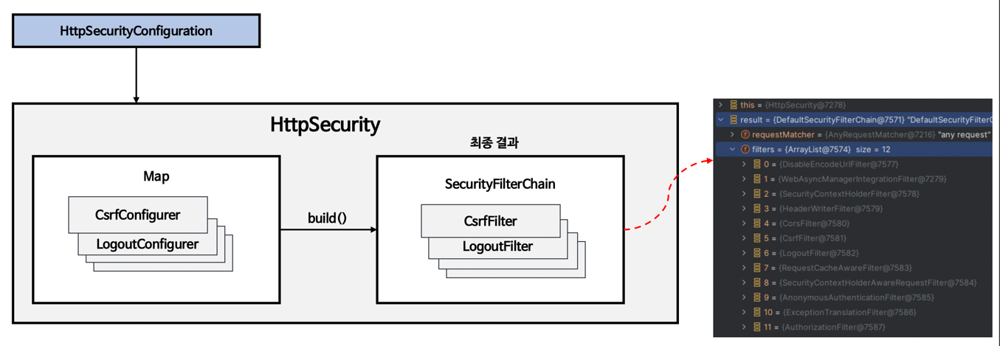
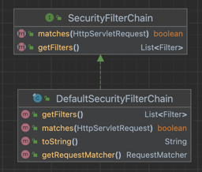
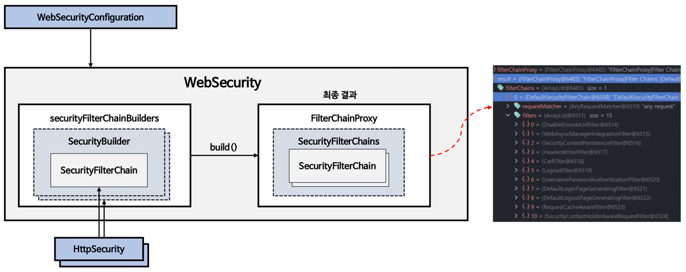
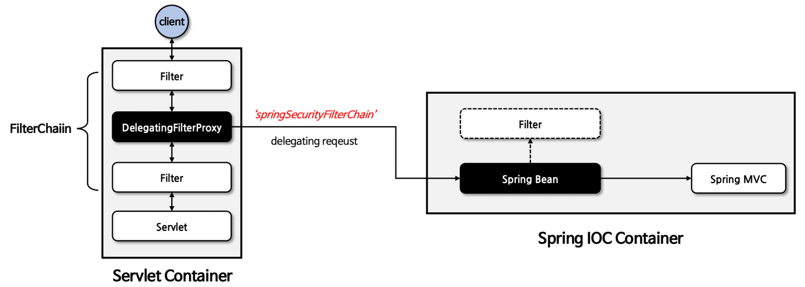
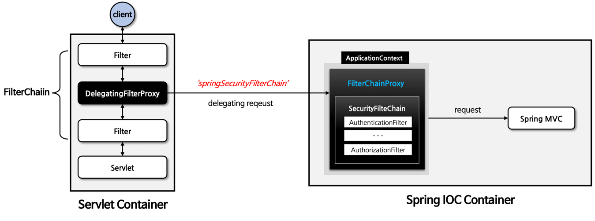
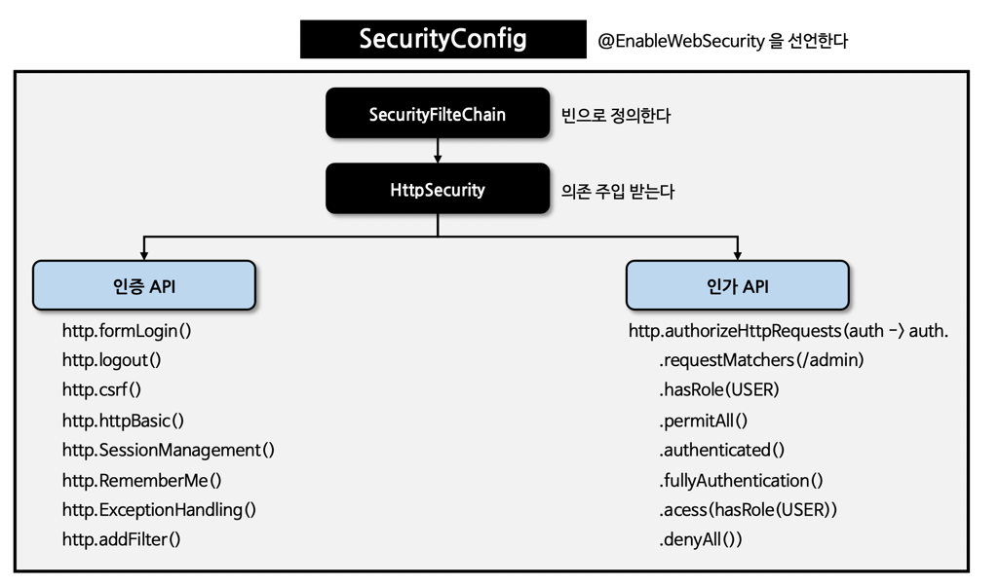

# 초기화 과정 이해

- 자동설정에 의한 기본 보안 작동
  서버가 기동되면 스프링 시큐리티의 초기화 작업 및 보안 설정이 이루어진다.   
  별도의 설정이나 코드를 작성하지 않아도 기본적인 웹 보안 기능이 작동한다.

- SpringBootWebSecurityConfiguration.java
  자동 설정에 의한 기본 보안 설정 클래스 생성

```java

@Configuration(proxyBeanMethods = false)
@ConditionalOnWebApplication(type = Type.SERVLET)
class SpringBootWebSecurityConfiguration {

  @Configuration(proxyBeanMethods = false)
  @ConditionalOnDefaultWebSecurity
  static class SecurityFilterChainConfiguration {

    @Bean
    @Order(SecurityProperties.BASIC_AUTH_ORDER)
    SecurityFilterChain defaultSecurityFilterChain(HttpSecurity http) throws Exception {
      http.authorizeHttpRequests((requests) -> requests.anyRequest().authenticated());
      http.formLogin(withDefaults());
      http.httpBasic(withDefaults());
      return http.build();
    }

  }
}
```

- SecurityBuilder / SecurityConfigurer

1) SecurityBuilder는 빌더 클래스로서 웹 보안을 구성하는 빈 객체와 설정클래스를 생성하는 역할을 하며 대표적으로 WebSecurity, HttpSecurity 가
   있다.
2) SecurityConfigurer는 http 요청과 관련된 보안처리를 담당하는 필터들을 생성하고 여러 초기화 설정에 관여한다.
3) SecurityBuilder는 SecurityConfigurer를 참조하고 있으며 인증 및 인가 초기화 작업은 SecurityConfigurer에 의해 진행된다.

- HttpSecurityConfiguration
  HttpSecurity Bean 생성

```java

@Configuration(proxyBeanMethods = false)
class HttpSecurityConfiguration {

  @Bean(HTTPSECURITY_BEAN_NAME)
  @Scope("prototype")
  HttpSecurity httpSecurity() throws Exception {
    LazyPasswordEncoder passwordEncoder = new LazyPasswordEncoder(this.context);
    AuthenticationManagerBuilder authenticationBuilder = new DefaultPasswordEncoderAuthenticationManagerBuilder(
        this.objectPostProcessor, passwordEncoder);
    authenticationBuilder.parentAuthenticationManager(authenticationManager());
    authenticationBuilder.authenticationEventPublisher(getAuthenticationEventPublisher());
    HttpSecurity http = new HttpSecurity(this.objectPostProcessor, authenticationBuilder,
        createSharedObjects());
    WebAsyncManagerIntegrationFilter webAsyncManagerIntegrationFilter = new WebAsyncManagerIntegrationFilter();
    webAsyncManagerIntegrationFilter.setSecurityContextHolderStrategy(
        this.securityContextHolderStrategy);

    //HttpSecurity.configurers 생성 (CsrfConfigurer, ExceptionHandlingConfigurer 등)
    http
        .csrf(withDefaults())
        .addFilter(webAsyncManagerIntegrationFilter)
        .exceptionHandling(withDefaults())
        .headers(withDefaults())
        .sessionManagement(withDefaults())
        .securityContext(withDefaults())
        .requestCache(withDefaults())
        .anonymous(withDefaults())
        .servletApi(withDefaults())
        .apply(new DefaultLoginPageConfigurer<>());
    http.logout(withDefaults());
    applyCorsIfAvailable(http);
    applyDefaultConfigurers(http);
    return http;
  }
}
```

- SpringBootWebSecurityConfiguration
  : 생성된 HttpSecurity Bean 을 받아서 build 메서드 호출   
  \>> AbstractConfiguredSecurityBuilder.doBuild 메서드
  \>> 설정된 configurers 를 순회하면서 SecurityConfigurer 메서드 init / configure 수행

```java
  public abstract class AbstractConfiguredSecurityBuilder<O, B extends SecurityBuilder<O>>
    extends AbstractSecurityBuilder<O> {

  @Override
  protected final O doBuild() throws Exception {
    synchronized (this.configurers) {
      this.buildState = BuildState.INITIALIZING;
      beforeInit();
      init();
      this.buildState = BuildState.CONFIGURING;
      beforeConfigure();
      configure();
      this.buildState = BuildState.BUILDING;
      O result = performBuild();
      this.buildState = BuildState.BUILT;
      return result;
    }
  }

  private void init() throws Exception {
    Collection<SecurityConfigurer<O, B>> configurers = getConfigurers();
    for (SecurityConfigurer<O, B> configurer : configurers) {
      configurer.init((B) this);
    }
    for (SecurityConfigurer<O, B> configurer : this.configurersAddedInInitializing) {
      configurer.init((B) this);
    }
  }

  private void configure() throws Exception {
    Collection<SecurityConfigurer<O, B>> configurers = getConfigurers();
    for (SecurityConfigurer<O, B> configurer : configurers) {
      configurer.configure((B) this);
    }
  }
}
```

- WebSecurity / HttpSecurity

◼︎ HttpSecurity

- HttpSecurityConfiguration 에서 HttpSecurity를 생성하고 초기화
- HttpSecurity는 보안에 필요한 각 설정 클래스와 필터들을 생성하고 최종적으로 SecurityFilterChain 빈 생성



◼︎ SecurityFilterChain


- matchers 메서드
  현재 client의 요청이 SecurityFilterChain에 의해 처리되어야 하는지 여부를 결정
  true를 반환하면 필터 처리 false를 반환하면 다른 필터로 넘어감

- getFilters 메서드
  현재 SecurityFilterChain에 포함된 Filter 객체의 리스트를 반환한다.
  이 메서드를 통해 어떤 필터들이 현재 필터 체인에` 포함되어 있지 확인할 수 있다.

◼︎ WebSecurity

- WebSecurityConfiguration에서 WebSecurity를 생성하고 초기화를 진행한다.
- WebSecurity는 HttpSecurity에서 생성한 SecurityFilterChain 빈을 SecurityBuilder에 저장한다.
- WebSecurity가 build()를 실행하면 SecurityBuilder에서 SecurityFilterChain을 꺼내어 FilterChainProxy 생성자에게 전달한다.
- WebSecurity는 HttpSecurity보다 상위 개념
- FilterChainProxy 빈을 생성하는 것이 최종목표



```java
public class WebSecurityConfiguration implements ImportAware, BeanClassLoaderAware {

  //...중략
  @Bean(name = AbstractSecurityWebApplicationInitializer.DEFAULT_FILTER_NAME)
  public Filter springSecurityFilterChain() throws Exception {
    boolean hasFilterChain = !this.securityFilterChains.isEmpty();
    if (!hasFilterChain) {
      this.webSecurity.addSecurityFilterChainBuilder(() -> {
        this.httpSecurity.authorizeHttpRequests(
            (authorize) -> authorize.anyRequest().authenticated());
        this.httpSecurity.formLogin(Customizer.withDefaults());
        this.httpSecurity.httpBasic(Customizer.withDefaults());
        return this.httpSecurity.build();
      });
    }
    for (SecurityFilterChain securityFilterChain : this.securityFilterChains) {
      this.webSecurity.addSecurityFilterChainBuilder(() -> securityFilterChain);
    }
    for (WebSecurityCustomizer customizer : this.webSecurityCustomizers) {
      customizer.customize(this.webSecurity);
    }
    return this.webSecurity.build();
  }
  //...중략
}
```

```java
public final class WebSecurity extends AbstractConfiguredSecurityBuilder<Filter, WebSecurity>
    implements SecurityBuilder<Filter>, ApplicationContextAware, ServletContextAware {

  protected Filter performBuild() throws Exception {
    //...중략
    List<SecurityFilterChain> securityFilterChains = new ArrayList<>(chainSize);

    for (
        SecurityBuilder<? extends SecurityFilterChain> securityFilterChainBuilder : this.securityFilterChainBuilders) {
      SecurityFilterChain securityFilterChain = securityFilterChainBuilder.build();
      securityFilterChains.add(securityFilterChain);
      requestMatcherPrivilegeEvaluatorsEntries
          .add(getRequestMatcherPrivilegeEvaluatorsEntry(securityFilterChain));
    }
    if (this.privilegeEvaluator == null) {
      this.privilegeEvaluator = new RequestMatcherDelegatingWebInvocationPrivilegeEvaluator(
          requestMatcherPrivilegeEvaluatorsEntries);
    }

    FilterChainProxy filterChainProxy = new FilterChainProxy(securityFilterChains);
    //...중략
  }
}
```

- DelegatingFilterProxy / FilterChainProxy

◼︎ DelegatingFilterProxy

- 스프링에서 사용되는 특별한 서블릿 필터로 서블릿 컨테이너와 스프링 어플리케이션 컨텍스트 간의 연결고리 역할을 하는 필터이다.
- 서블릿 필터의 기능을 수행하는 동시에 스프링의 의존성 주입 및 빈 관리 기능과 연동되도록 설계된 필터
- "springSecurityFilterChain" 이름으로 생성된 빈을 ApplicationContext에서 찾아 요청을 위임
- 실제 보안 처리를 수행하지 않는다.



◼︎ FilterChainProxy

- springSecurityFilterChain 의 이름으로 생성되는 필터 빈으로서 DelegatingFilterProxy로 부터 요청을 위임 받고 보안 처리 역할을 한다.
- 내부적으로 하나 이상의 SecurityFilterChain 객체들을 갖고 있으며 요청 url 정보를 기준으로 적절한 SecurityFilterChain을 선택하여 필터들을
  호출한다.
- HttpSecurity를 통해 API 추가 시 관련 필터들이 추가된다.
- 사용자의 요청을 필터 순서대로 호출함으로 보안 기능을 동작시키고 필요 시 직접 필터를 생성해서 기존의 필터 전/후 추가 가능하다.



============= Application Load =============

1. SecurityFilterAutoConfiguration 설정파일 read
2. DelegatingFilterProxyRegistrationBean 빈 등록
   => 아직 "springSecurityFilterChain" Bean은 등록되어 있지 않음
3. AbstractFilterRegistrationBean addRegistration 메서드
   => ServletContext에 "springSecurityFilterChain" 이름으로 DelegatingFilterProxy 필터 add
4. HttpSecurityConfiguration 설정파일 read
5. HttpSecurity Bean 생성
6. SecurityFilterChainConfiguration 설정파일 read
7. SecurityFilterChain Bean 생성
   => WebSecurityConfiguration setFilterChains 메서드 호출
8. WebSecurityConfiguration springSecurityFilterChain 메서드
   => "springSecurityFilterChain" 이름으로 FilterChainProxy Filter Bean 생성

```java

@AutoConfiguration(after = SecurityAutoConfiguration.class)
@ConditionalOnWebApplication(type = Type.SERVLET)
@EnableConfigurationProperties(SecurityProperties.class)
@ConditionalOnClass({AbstractSecurityWebApplicationInitializer.class, SessionCreationPolicy.class})
public class SecurityFilterAutoConfiguration {

  private static final String DEFAULT_FILTER_NAME = AbstractSecurityWebApplicationInitializer.DEFAULT_FILTER_NAME;  //"springSecurityFilterChain"

  @Bean
  @ConditionalOnBean(name = DEFAULT_FILTER_NAME)
  public DelegatingFilterProxyRegistrationBean securityFilterChainRegistration(
      SecurityProperties securityProperties) {
    DelegatingFilterProxyRegistrationBean registration = new DelegatingFilterProxyRegistrationBean(
        DEFAULT_FILTER_NAME);
    registration.setOrder(securityProperties.getFilter().getOrder());
    registration.setDispatcherTypes(getDispatcherTypes(securityProperties));
    return registration;
  }
}

public abstract class AbstractFilterRegistrationBean<T extends Filter> extends
    DynamicRegistrationBean<Dynamic> {

  @Override
  protected Dynamic addRegistration(String description, ServletContext servletContext) {
    Filter filter = getFilter();
    return servletContext.addFilter(getOrDeduceName(filter), filter);
  }
}

public class DelegatingFilterProxyRegistrationBean extends
    AbstractFilterRegistrationBean<DelegatingFilterProxy>
    implements ApplicationContextAware {

  @Override
  public DelegatingFilterProxy getFilter() {
    return new DelegatingFilterProxy(this.targetBeanName,
        getWebApplicationContext()) { //this.targetBeanName == "springSecurityFilterChain"

      @Override
      protected void initFilterBean() throws ServletException {
        // Don't initialize filter bean on init()
      }
    };
  }
}


@Configuration(proxyBeanMethods = false)
public class WebSecurityConfiguration implements ImportAware, BeanClassLoaderAware {

  @Bean(name = AbstractSecurityWebApplicationInitializer.DEFAULT_FILTER_NAME)
  //"springSecurityFilterChain"
  public Filter springSecurityFilterChain() throws Exception {
    boolean hasFilterChain = !this.securityFilterChains.isEmpty();
    if (!hasFilterChain) {
      this.webSecurity.addSecurityFilterChainBuilder(() -> {
        this.httpSecurity.authorizeHttpRequests(
            (authorize) -> authorize.anyRequest().authenticated());
        this.httpSecurity.formLogin(Customizer.withDefaults());
        this.httpSecurity.httpBasic(Customizer.withDefaults());
        return this.httpSecurity.build();
      });
    }
    for (SecurityFilterChain securityFilterChain : this.securityFilterChains) {
      this.webSecurity.addSecurityFilterChainBuilder(() -> securityFilterChain);
    }
    for (WebSecurityCustomizer customizer : this.webSecurityCustomizers) {
      customizer.customize(this.webSecurity);
    }
    return this.webSecurity.build();
  }
}
```

============== Client Request Filter ===============

1. ServletContext에 등록된 필터 체인 순으로 doFilter 수행
2. DelegatingFilterProxy doFilter 메서드 호출
    - initDelegate 메서드
      : 초기화 되지 않았으면 "springSecurityFilterChain" 이름으로 등록된 Filter Bean(FilterChainProxy)을 가져온다.

    - 초기화 된 FilterChainProxy 를 차례로 순회하며 Security Filter 보안 검증을 수행 한다.

```java
public class DelegatingFilterProxy extends GenericFilterBean {

  @Override
  public void doFilter(ServletRequest request, ServletResponse response, FilterChain filterChain)
      throws ServletException, IOException {

    // Lazily initialize the delegate if necessary.
    Filter delegateToUse = this.delegate;
    if (delegateToUse == null) {
      synchronized (this.delegateMonitor) {
        delegateToUse = this.delegate;
        if (delegateToUse == null) {
          WebApplicationContext wac = findWebApplicationContext();
          if (wac == null) {
            throw new IllegalStateException("No WebApplicationContext found: " +
                "no ContextLoaderListener or DispatcherServlet registered?");
          }
          delegateToUse = initDelegate(wac);
        }
        this.delegate = delegateToUse;
      }
    }

    // Let the delegate perform the actual doFilter operation.
    invokeDelegate(delegateToUse, request, response, filterChain);
  }

  protected Filter initDelegate(WebApplicationContext wac) throws ServletException {
    String targetBeanName = getTargetBeanName();//"springSecurityFilterChain"
    Assert.state(targetBeanName != null, "No target bean name set");
    Filter delegate = wac.getBean(targetBeanName,
        Filter.class);  //"springSecurityFilterChain" 이름으로 등록된 Filter Bean을 찾아 반환 
    if (isTargetFilterLifecycle()) {
      delegate.init(getFilterConfig());
    }
    return delegate;
  }
}
```

◼︎ 사용자 정의 보안 기능 구현

- 한 개 이상의 SecurityFilterChain 타입의 빈을 정의한 후 인증 및 인가 API를 설정한다.



```java

@EnableWebSecurity
@Configuration
public class SecurityConfig {

  @Bean
  public SecurityFilterChain securityFilterChain(HttpSecurity http) throws Exception {
    http
        .authorizeHttpRequests(auth -> auth.anyRequest().authenticated())
        .formLogin(Customizer.withDefaults());

    return http.build();
  }
}
```

SecurityFilterChain이 bean으로 등록 되어 있으면 SecurityFilterChainConfiguration defaultSecurityFilterChain
메서드 호출되지 않음

```java

@Configuration(proxyBeanMethods = false)
@ConditionalOnDefaultWebSecurity
static class SecurityFilterChainConfiguration {

  @Bean
  @Order(SecurityProperties.BASIC_AUTH_ORDER)
  SecurityFilterChain defaultSecurityFilterChain(HttpSecurity http) throws Exception {
    http.authorizeHttpRequests((requests) -> requests.anyRequest().authenticated());
    http.formLogin(withDefaults());
    http.httpBasic(withDefaults());
    return http.build();
  }

}
```
