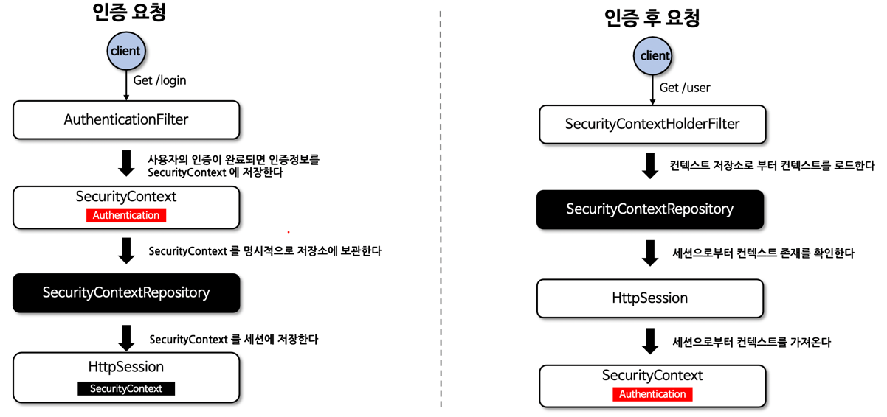
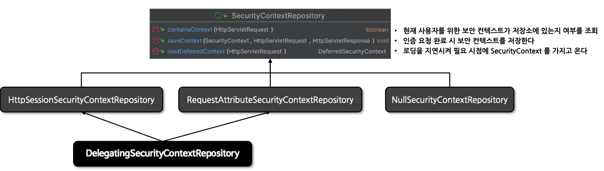
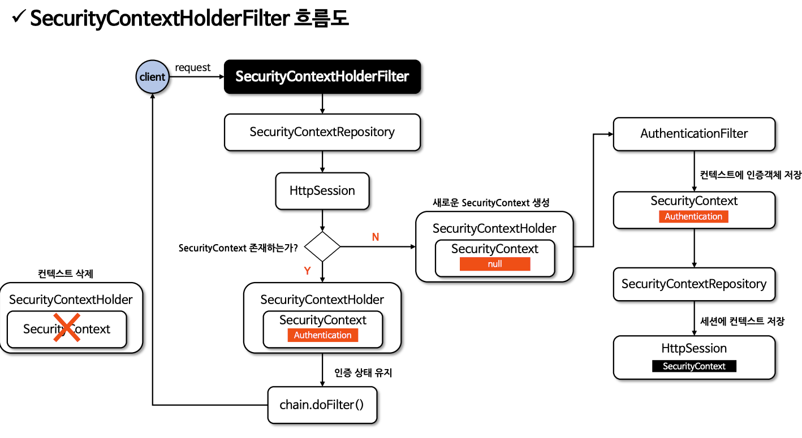
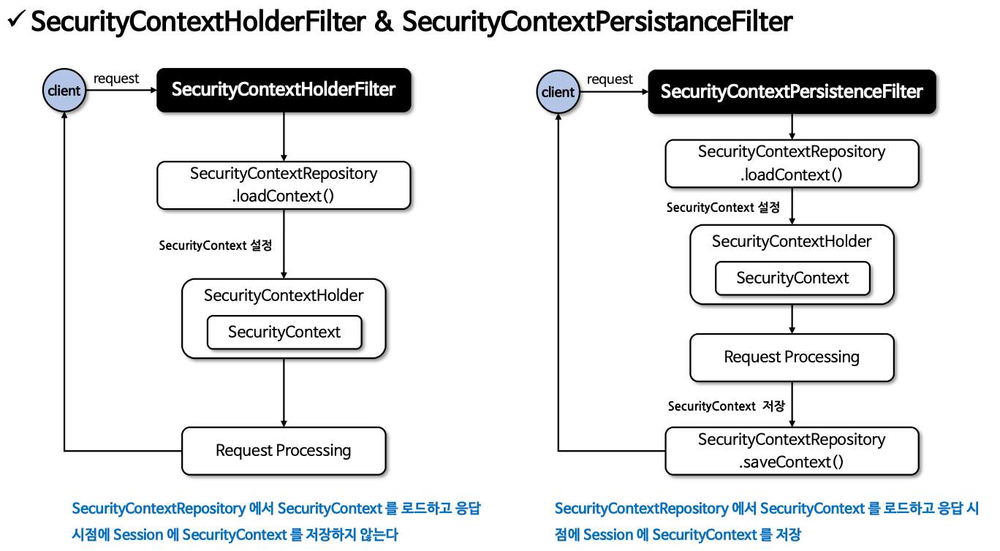

# 인증상태 영속성

## SecurityContextRepository

- 스프링 시큐리티에서 사용자가 인증을 한 이후 요청에 대해 사용자의 인증을 계속해서 유지하기 위해 사용되는 클래스
- 인증 상태의 영속 메커니즘은 사용자가 인증을 하게 되면 해당 사용자의 인증 정보와 권한이 SecurityContext에 저장되고 HttpSession을 통해 요청간 영속이
  이루어진다.





- HttpSessionSecurityContextRepository : 요청 간에 HttpSession에 보안 컨텍스트를 저장한다. 후속 요청 시 컨텍스트 영속성을 유지
- RequestAttributeSecurityContextRepository : ServletRequest에 보안 컨텍스트를 저장한다. 후속 요청 시 컨텍스트 영속성을 잃는다.
- NullSecurityContextRepository : 세션을 사용하지 않는 인증(JWT, OAuth2)일 경우 사용하며 컨텍스트 관련 아무런 처리를 하지 않는다.
- DelegatingSecurityContextRepository : HttpSessionSecurityContextRepository 나
  RequestAttributeSecurityContextRepository를 동시에 사용할 수 있도록 위임된 클래스로서 초기화 시 기본으로 설정

## SecurityContextHolderFilter

- SecurityContextRepository 를 사용하여 SecurityContext를 얻고 SecurityContextHolder에 설정
- SecurityContextRepository 를 커스텀할 경우 SecurityContextRepository.saveContext()를 직접 선언해야 한다.   
  SecurityContextPersistenceFilter 는 시큐리티 필터에서 직접 처리해준다.

```java
/**
 * SecurityContextConfigurer.configure 
 * 어플리케이션 기동 시 해당 메서드에서 requireExplicitSave 옵션에 따라서 SecurityContextHolderFilter / SecurityContextPersistenceFilter 처리 선택
 * requireExplicitSave : true(defualt)
 * @param <H>
 */
public final class SecurityContextConfigurer<H extends HttpSecurityBuilder<H>>
    extends AbstractHttpConfigurer<SecurityContextConfigurer<H>, H> {

  @Override
  @SuppressWarnings("unchecked")
  public void configure(H http) {
    SecurityContextRepository securityContextRepository = getSecurityContextRepository();
    if (this.requireExplicitSave) {
      SecurityContextHolderFilter securityContextHolderFilter = postProcess(
          new SecurityContextHolderFilter(securityContextRepository));
      securityContextHolderFilter.setSecurityContextHolderStrategy(
          getSecurityContextHolderStrategy());
      http.addFilter(securityContextHolderFilter);
    } else {
      SecurityContextPersistenceFilter securityContextFilter = new SecurityContextPersistenceFilter(
          securityContextRepository);
      securityContextFilter.setSecurityContextHolderStrategy(getSecurityContextHolderStrategy());
      SessionManagementConfigurer<?> sessionManagement = http.getConfigurer(
          SessionManagementConfigurer.class);
      SessionCreationPolicy sessionCreationPolicy = (sessionManagement != null)
          ? sessionManagement.getSessionCreationPolicy() : null;
      if (SessionCreationPolicy.ALWAYS == sessionCreationPolicy) {
        securityContextFilter.setForceEagerSessionCreation(true);
        http.addFilter(postProcess(new ForceEagerSessionCreationFilter()));
      }
      securityContextFilter = postProcess(securityContextFilter);
      http.addFilter(securityContextFilter);
    }
  }
}
```

```
//SecurityContextPersistenceFilter SecurityContextRepository.saveContext 메서드 호출
private void doFilter(HttpServletRequest request,HttpServletResponse response,FilterChain chain)
    throws IOException,ServletException {
    //...중략
    this.repo.saveContext(contextAfterChainExecution, holder.getRequest(), holder.getResponse());
    //...중략
}
```

## SecurityContext 생성, 저장, 삭제

1. 익명사용자
    - SecurityContextRepository를 사용하여 새로운 SecurityContext 객체를 생성하여 SecurityContextHolder에 저장 후 다음
      필터로 전달
    - AnonymousAuthenticationFilter에서 AnonymousAuthenticationToken 객체를 SecurityContext에 저장

2. 인증요청
    - SecurityContextRepository를 사용하여 새로운 SecurityContext 객체를 생성하여 SecurityContextHolder에 저장 후 다음
      필터로 전달
    - UsernamePasswordAuthenticationFilter에서 인증 성공 후 SecurityContext에 UsernamePasswordAuthentication
      객체를 SecurityContext에 저장
    - SecurityContextRepository를 사용하여 HttpSession에 SecurityContext 저장

3. 인증 후 요청

- SecurityContextRepository를 사용하여 HttpSession에서 SecurityContext를 꺼내서 SecurityContextHolder에 저장 후 다음
  필터로 전달
- SecurityContext 안에 Authentication 객체가 존재하면 계속 인증 유지

4. 클라이언트 응답 시 공통

- SecurityContextHolder.clearContext() 로 컨텍스트를 삭제 한다.

## SecurityContextHolderFilter 흐름도



## SecurityContextHolderFilter && SecurityContextPersistenceFilter



- SecurityContextPersistanceFilter는 Deprecated 되었음. SecurityContextHolderFilter 사용하기

## CustomAuthenticationFilter & SecurityContextRepository

커스텀한 인증 필터를 구현할 경우 AbstractAuthenticationProcessingFilter의 SecurityContextRepository 멤버변수 defualt가
RequestAttributeSecurityContextRepository 이기 때문에 명시적으로 HttpSessionSecurityContextRepository 선언이
필요하다.

```java
public abstract class AbstractAuthenticationProcessingFilter extends GenericFilterBean
    implements ApplicationEventPublisherAware, MessageSourceAware {

  //...중략
  private SecurityContextRepository securityContextRepository = new RequestAttributeSecurityContextRepository();
}
```

```java
/**
 * AbstractAuthenticationProcessingFilter.setSecurityContextRepository 메서드 호출해서 AbstractAuthenticationProcessingFilter.securityContextRepository 변경
 */
public class CustomAuthenticationFilter extends AbstractAuthenticationProcessingFilter {

  public CustomAuthenticationFilter(HttpSecurity http) {
    super(new AntPathRequestMatcher("/api/login", "GET"));
    setSecurityContextRepository(getSecurityContextRepository(http));
  }

  private SecurityContextRepository getSecurityContextRepository(HttpSecurity http) {
    SecurityContextRepository securityContextRepository = http.getSharedObject(
        SecurityContextRepository.class);
    if (securityContextRepository == null) {
      securityContextRepository = new DelegatingSecurityContextRepository(
          new RequestAttributeSecurityContextRepository(),
          new HttpSessionSecurityContextRepository());
    }
    return securityContextRepository;
  }
}
```

## 스프링 MVC 인증 구현

- 시큐리티 필터 대신 MVC 컨트롤러 엔드포인트에서 인증 구현

```java

@RestController
@RequiredArgsConstructor
public class LoginController {

  private final AuthenticationManager authenticationManager;
  private final HttpSessionSecurityContextRepository securityContextRepository = new HttpSessionSecurityContextRepository();

  @PostMapping("/login")
  public Authentication customLogin(@RequestBody LoginRequest login, HttpServletRequest request,
      HttpServletResponse response) {

    UsernamePasswordAuthenticationToken token = new UsernamePasswordAuthenticationToken(
        login.getUsername(), login.getPassword());
    Authentication authentication = authenticationManager.authenticate(
        token);  //completed Authentication

    SecurityContext securityContext = SecurityContextHolder.createEmptyContext();
    securityContext.setAuthentication(authentication);
    SecurityContextHolder.getContextHolderStrategy().setContext(securityContext);//Thread Local Save

    securityContextRepository.saveContext(securityContext, request, response);//Session Save

    return authentication;
  }
}

```