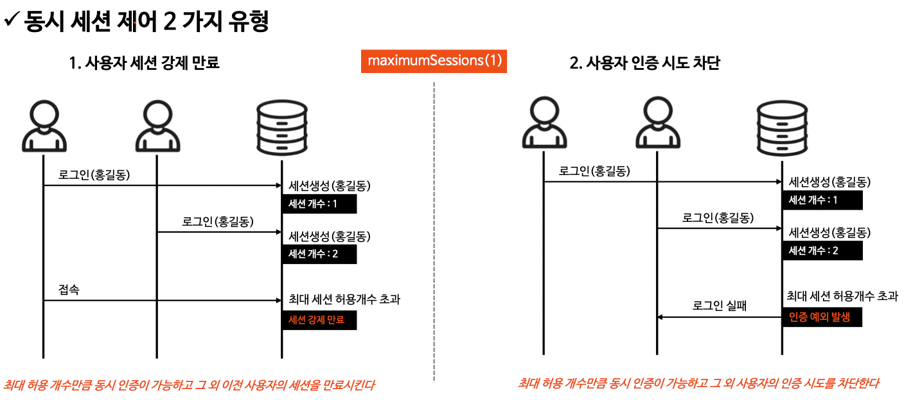
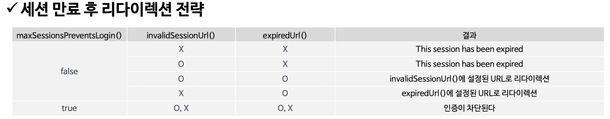
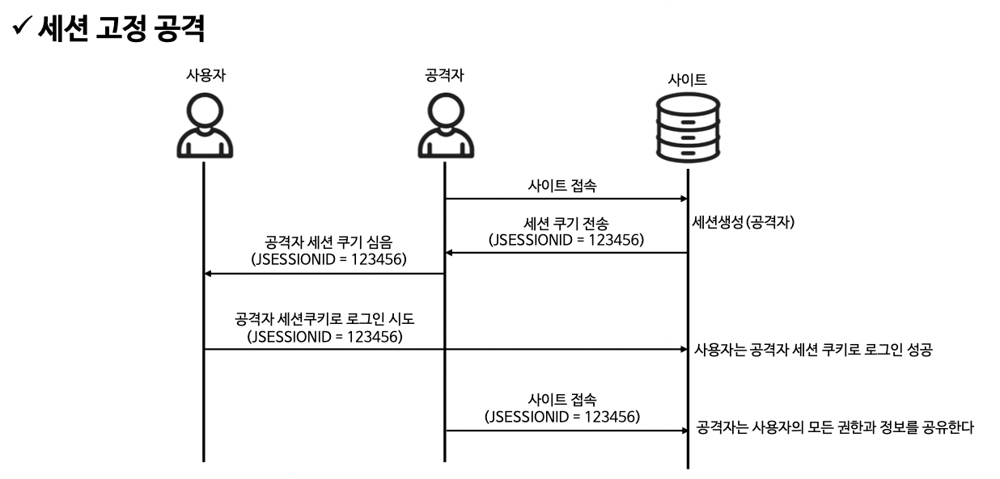
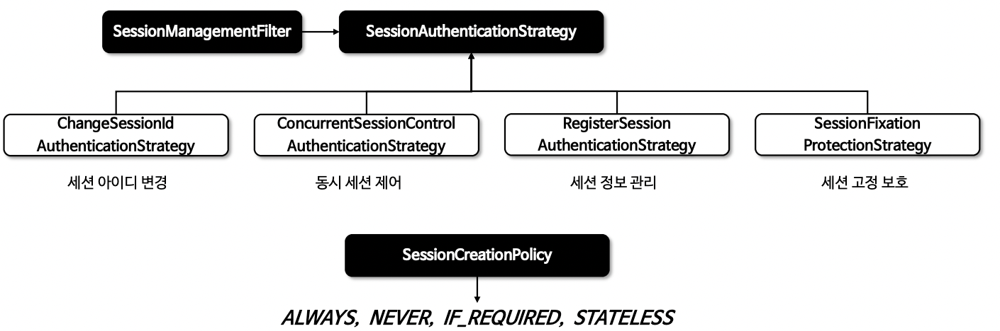
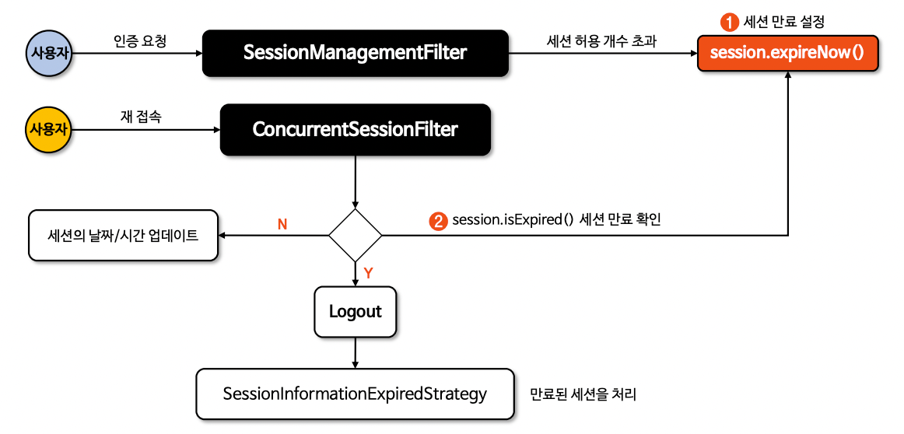
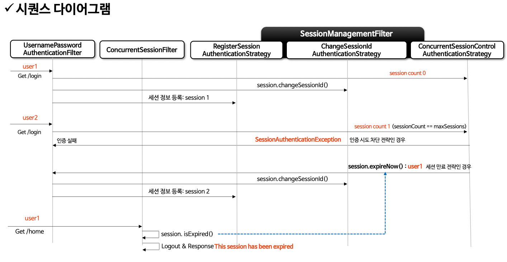

# 세션관리

## 동시세션 제어

- 동시세션 제어는 사용자가 동시에 여러 세션을 생성하는 것을 관리하는 전략이다.
- 이 전략은 사용자의 인증 후에 활성화된 세션의 수가 설정된 maximumSessions 값과 비교하여 제어 여부를 결정한다.

#### 동시세션 제어 2가지 유형

1. 사용자 세션 강제 만료(default)
    - login 완료된 사용자의 세션을 만료 시킨다.

2. 사용자 인증 시도 차단
    - login 요청한 사용자의 인증 시도를 차단한다.



#### sessionManagement() - 동시세션 제어

```java

@EnableWebSecurity
@Configuration
public class SecurityConfig {

  @Bean
  public SecurityFilterChain securityFilterChain(HttpSecurity http) throws Exception {

    http
        .sessionManagement(session -> session
            .invalidSessionUrl("/invalidSessionUrl") // 만료 세션 redirect url 지정 
            .maximumSessions(1) // 사용자당 최대 세션 수 제어. 기본값은 무제한 세션 허용
            .maxSessionsPreventsLogin(true) // true : 요청 사용자 인증 차단 / false(default) : 로그인된 사용자 세션 만료
            .expiredUrl("/expired") // 만료 세션 redirect url 지정
        );

    return http.build();
  }
}
```

#### 세션 만료 후 리다이렉션 전략



## 세션 고정보호 전략

- 세션 고정 공격은 악의적인 공격자가 사이트에 접근하여 A 세션을 생성 한 다음, 사용자가 A 세션으로 로그인 하도록 유도
- 사용자가 로그인할 때 새로운 세션을 생성하거나 세션 ID를 변경 함으로서 세션 고정 공격으로부터 방어한다.

#### 세션 고정 공격 case



#### sessionManagement() - 세션고정 보호

```java

@EnableWebSecurity
@Configuration
public class SecurityConfig {

  @Bean
  public SecurityFilterChain securityFilterChain(HttpSecurity http) throws Exception {

    http
        .sessionManagement(session -> session
            .sessionFixation(sessionFixation -> sessionFixation.newSession())
        );

    return http.build();
  }
}
```

#### 세션 고정보호 전략

- sessionFixation.changeSessionId()
  : 기존 세션을 유지 하면서 세션 ID만 변경(default)

- sessionFixation.newSession()
  : 새로운 세션을 생성(기존 세션 데이터는 복사하지 않음)

- sessionFixation.migrateSession()
  : 새로운 세션을 생성(기존 세션 데이터 복사)

- sessionFixation.none()
  : 기존 세션을 그대로 사용

## 세션 생성 정책

- 인증된 사용자에 대한 세션 생성 정책을 SessionCreationPolicy 으로 설정

#### 세션 생성 정책 전략

- SessionCreationPolicy.ALWAYS
  : 인증 여부에 상관없이 항상 세션 생성
  : ForceEagerSessionCreationFilter 필터를 추가

- SessionCreationPolicy.NEVER
  : 세션을 직접 생성하진 않음. 어플리케이션이 이미 생성한 세션을 사용

- SessionCreationPolicy.IF_REQUIRED
  : 필요한 경우(로그인 인증 후)에만 세션 생성 (default)

- SessionCreationPolicy.STATELISS
  : 세션을 생성하지 않고 사용하지 않는다.
  : JWT 와 같이 토큰 방식 인증 시 설정
  : SecurityContext 를 세션을 저장하지 않는다.
  : SecurityContext 를 매 요청마다 생성하므로 컨텍스트 영속성이 유지되지 않음.

#### sessionManagement() - 세션 생성정책

```java

@EnableWebSecurity
@Configuration
public class SecurityConfig {

  @Bean
  public SecurityFilterChain securityFilterChain(HttpSecurity http) throws Exception {

    http
        .sessionManagement(session -> session
            .sessionCreationPolicy(SessionCreationPolicy.STATELESS)
        );

    return http.build();
  }
}
```

#### STATELESS 설정에도 세션이 생성될 수 있다.

- CSRF 기능이 활성화 되어 있을 경우 세션에 CSRF 토큰을 저장한다.
- 인증과 관련된 세션 처리는 하지 않는다.

## SessionManagementFilter

- 로그인 세션 정보 관리
- 사용자 인증 여부 체킹
- 동시 세션 제어
- 세션 고정 보호 전략 수행

#### SessionManagementFilter 구성



## ConcurrentSessionFilter

- 세션 만료 체킹



## SessionManagementFilter && ConcurrentSessionFilter 시퀀스



```java
/**
 * SessionManagementConfigurer 초기설정 (init / configure 메서드)
 * @param <H>
 */
public final class SessionManagementConfigurer<H extends HttpSecurityBuilder<H>>
    extends AbstractHttpConfigurer<SessionManagementConfigurer<H>, H> {

  @Override
  public void init(H http) {
    SecurityContextRepository securityContextRepository = http.getSharedObject(
        SecurityContextRepository.class);
    boolean stateless = isStateless();
    if (securityContextRepository == null) {
      if (stateless) {
        http.setSharedObject(SecurityContextRepository.class,
            new RequestAttributeSecurityContextRepository());
        this.sessionManagementSecurityContextRepository = new NullSecurityContextRepository();    // 세션생성 정책이 STATELESS 이면 NullSecurityContextRepository 설정
      } else {
        HttpSessionSecurityContextRepository httpSecurityRepository = new HttpSessionSecurityContextRepository();
        httpSecurityRepository.setDisableUrlRewriting(!this.enableSessionUrlRewriting);
        httpSecurityRepository.setAllowSessionCreation(isAllowSessionCreation());
        AuthenticationTrustResolver trustResolver = http.getSharedObject(
            AuthenticationTrustResolver.class);
        if (trustResolver != null) {
          httpSecurityRepository.setTrustResolver(trustResolver);
        }
        this.sessionManagementSecurityContextRepository = httpSecurityRepository;   // 세션생성 정책이 STATELESS 가 아니면 HttpSessionSecurityContextRepository 설정
        DelegatingSecurityContextRepository defaultRepository = new DelegatingSecurityContextRepository(
            httpSecurityRepository, new RequestAttributeSecurityContextRepository());
        http.setSharedObject(SecurityContextRepository.class, defaultRepository);
      }
    } else {
      this.sessionManagementSecurityContextRepository = securityContextRepository;
    }
    RequestCache requestCache = http.getSharedObject(RequestCache.class);
    if (requestCache == null) {
      if (stateless) {
        http.setSharedObject(RequestCache.class, new NullRequestCache());
      }
    }
    http.setSharedObject(SessionAuthenticationStrategy.class,
        getSessionAuthenticationStrategy(http));  // 세션인증 전략 설정
    http.setSharedObject(InvalidSessionStrategy.class, getInvalidSessionStrategy());
  }

  @Override
  public void configure(H http) {
    SessionManagementFilter sessionManagementFilter = createSessionManagementFilter(
        http);  // http.sessionManagement 설정 check
    if (sessionManagementFilter != null) {
      http.addFilter(sessionManagementFilter);
    }
    if (isConcurrentSessionControlEnabled()) {    // http.maximumSessions 설정 check
      ConcurrentSessionFilter concurrentSessionFilter = createConcurrencyFilter(http);

      concurrentSessionFilter = postProcess(concurrentSessionFilter);
      http.addFilter(concurrentSessionFilter);
    }
    if (!this.enableSessionUrlRewriting) {
      http.addFilter(new DisableEncodeUrlFilter());
    }
    if (this.sessionPolicy == SessionCreationPolicy.ALWAYS) { // 세션 생성전략 ALWAYS check
      http.addFilter(new ForceEagerSessionCreationFilter());
    }
  }

  private SessionAuthenticationStrategy getSessionAuthenticationStrategy(H http) {
    if (this.sessionAuthenticationStrategy != null) {
      return this.sessionAuthenticationStrategy;
    }
    List<SessionAuthenticationStrategy> delegateStrategies = this.sessionAuthenticationStrategies;
    SessionAuthenticationStrategy defaultSessionAuthenticationStrategy;
    if (this.providedSessionAuthenticationStrategy == null) {
      // If the user did not provide a SessionAuthenticationStrategy
      // then default to sessionFixationAuthenticationStrategy
      defaultSessionAuthenticationStrategy = postProcess(
          this.sessionFixationAuthenticationStrategy);        // 세션생성 전략 defualt : changeSessionId
    } else {
      defaultSessionAuthenticationStrategy = this.providedSessionAuthenticationStrategy;
    }
    if (isConcurrentSessionControlEnabled()) {                // http.maximumSessions 설정 check
      SessionRegistry sessionRegistry = getSessionRegistry(http);
      ConcurrentSessionControlAuthenticationStrategy concurrentSessionControlStrategy = new ConcurrentSessionControlAuthenticationStrategy(
          sessionRegistry);
      concurrentSessionControlStrategy.setMaximumSessions(this.maximumSessions);
      concurrentSessionControlStrategy.setExceptionIfMaximumExceeded(this.maxSessionsPreventsLogin);
      concurrentSessionControlStrategy = postProcess(concurrentSessionControlStrategy);
      RegisterSessionAuthenticationStrategy registerSessionStrategy = new RegisterSessionAuthenticationStrategy(
          sessionRegistry);
      registerSessionStrategy = postProcess(registerSessionStrategy);

      delegateStrategies.addAll(Arrays.asList(concurrentSessionControlStrategy,
          defaultSessionAuthenticationStrategy,
          registerSessionStrategy));        // 동시성 세션 제어 관련 전략 addAll
    } else {
      delegateStrategies.add(defaultSessionAuthenticationStrategy);
    }
    this.sessionAuthenticationStrategy = postProcess(
        new CompositeSessionAuthenticationStrategy(delegateStrategies));
    return this.sessionAuthenticationStrategy;
  }
}
```

```java
/**
 * FilterProxy 앞 단에서 수행
 * 세션 만료 여부 검증 후 만료 되었으면 invalidSessionUrl 리다이렉트 처리
 * 만료되지 않았으면 마지막 세션 시간 update
 */
public class ConcurrentSessionFilter extends GenericFilterBean {

  private void doFilter(HttpServletRequest request, HttpServletResponse response, FilterChain chain)
      throws IOException, ServletException {
    HttpSession session = request.getSession(false);
    if (session != null) {
      SessionInformation info = this.sessionRegistry.getSessionInformation(session.getId());
      if (info != null) {
        if (info.isExpired()) {
          // Expired - abort processing
          this.logger.debug(LogMessage
              .of(() -> "Requested session ID " + request.getRequestedSessionId()
                  + " has expired."));
          doLogout(request, response);
          this.sessionInformationExpiredStrategy
              .onExpiredSessionDetected(
                  new SessionInformationExpiredEvent(info, request, response));
          return;
        }
        // Non-expired - update last request date/time
        this.sessionRegistry.refreshLastRequest(info.getSessionId());
      }
    }
    chain.doFilter(request, response);
  }
}
```

```java
/**
 * 세션인증 전략에 대한 인증 처리 메서드 호출
 * CompositeSessionAuthenticationStrategy.onAuthentication 메서드 호출
 */
public class SessionManagementFilter extends GenericFilterBean {

  private void doFilter(HttpServletRequest request, HttpServletResponse response, FilterChain chain)
      throws IOException, ServletException {
    //..... 중략
    this.sessionAuthenticationStrategy.onAuthentication(authentication, request, response);
  }
}

/**
 * SessionManagementConfigurer 초기설정 으로 설정된 세션 인증 전략 수행
 *
 * 동시세션 제어 설정 시 this.delegateStrategies 리스트 목록
 *
 * ConcurrentSessionControlAuthenticationStrategy
 * ChangeSessionIdAuthenticationStrategy(default)
 * RegisterSessionAuthenticationStrategy
 *
 * for (SessionAuthenticationStrategy delegate : this.delegateStrategies) {
 *    delegate.onAuthentication(authentication, request, response);
 * }
 */
public class CompositeSessionAuthenticationStrategy implements SessionAuthenticationStrategy {

  private final List<SessionAuthenticationStrategy> delegateStrategies;

  @Override
  public void onAuthentication(Authentication authentication, HttpServletRequest request,
      HttpServletResponse response) throws SessionAuthenticationException {
    int currentPosition = 0;
    int size = this.delegateStrategies.size();
    for (SessionAuthenticationStrategy delegate : this.delegateStrategies) {
      if (this.logger.isTraceEnabled()) {
        this.logger.trace(LogMessage.format("Preparing session with %s (%d/%d)",
            delegate.getClass().getSimpleName(), ++currentPosition, size));
      }
      delegate.onAuthentication(authentication, request, response);
    }
  }
}
```

```java
/**
 * http.maximumSessions 설정 되어 있으면 동시 세션제어 관련 인증 수행
 */
public class ConcurrentSessionControlAuthenticationStrategy
    implements MessageSourceAware, SessionAuthenticationStrategy {

  @Override
  public void onAuthentication(Authentication authentication, HttpServletRequest request,
      HttpServletResponse response) {
    int allowedSessions = getMaximumSessionsForThisUser(authentication);
    if (allowedSessions == -1) {  // default 무제한
      return;
    }
    List<SessionInformation> sessions = this.sessionRegistry.getAllSessions(
        authentication.getPrincipal(), false);
    int sessionCount = sessions.size();
    if (sessionCount < allowedSessions) { // 허가된 세션 설정 값 보다 현 세션 count가 작아서 인증 가능
      return;
    }
    if (sessionCount == allowedSessions) {
      HttpSession session = request.getSession(false);
      if (session != null) {
        for (SessionInformation si : sessions) {
          if (si.getSessionId().equals(session.getId())) {
            return;
          }
        }
      }
    }
    allowableSessionsExceeded(sessions, allowedSessions, this.sessionRegistry); //세션초과 check
  }

  protected void allowableSessionsExceeded(List<SessionInformation> sessions, int allowableSessions,
      SessionRegistry registry) throws SessionAuthenticationException {
    if (this.exceptionIfMaximumExceeded || (sessions == null)) {  // 세션 초과 되었으면 로그인 불가
      throw new SessionAuthenticationException(
          this.messages.getMessage("ConcurrentSessionControlAuthenticationStrategy.exceededAllowed",
              new Object[]{allowableSessions},
              "Maximum sessions of {0} for this principal exceeded"));
    }
    sessions.sort(Comparator.comparing(SessionInformation::getLastRequest));
    int maximumSessionsExceededBy = sessions.size() - allowableSessions + 1;
    List<SessionInformation> sessionsToBeExpired = sessions.subList(0, maximumSessionsExceededBy);
    for (SessionInformation session : sessionsToBeExpired) {
      session.expireNow();    // 이전 사용자 세션 만료 처리
    }
  }
}
```