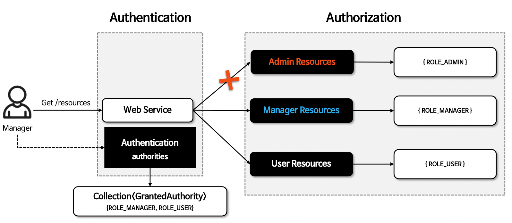
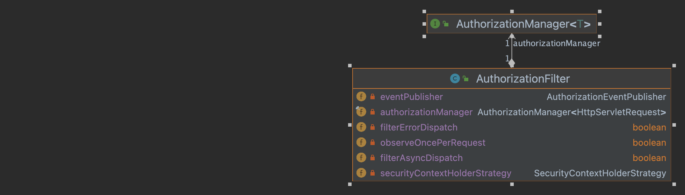
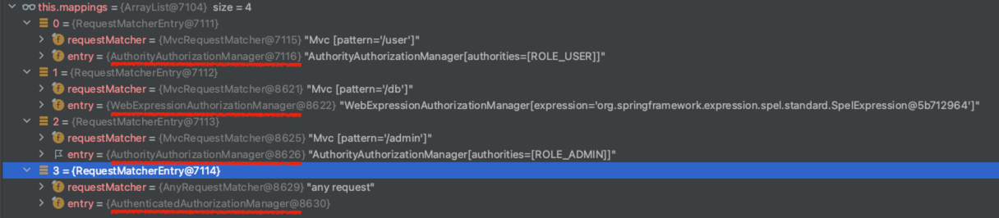
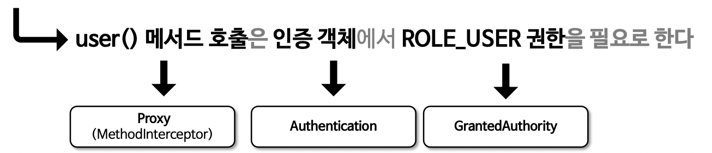
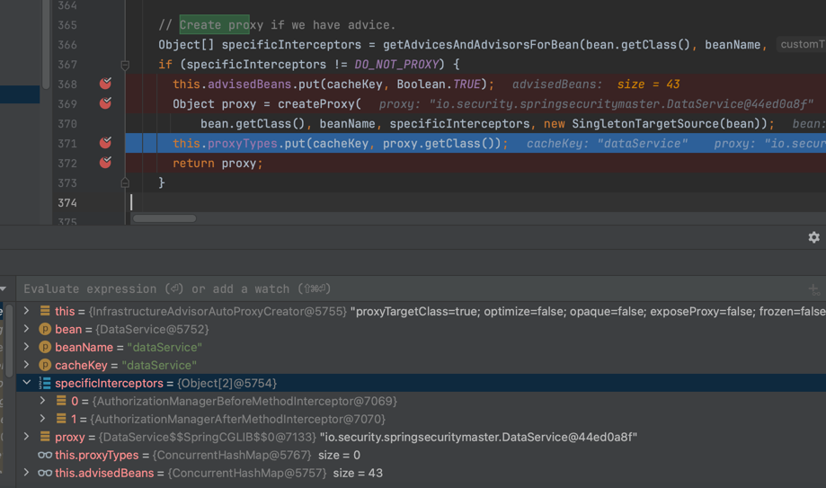
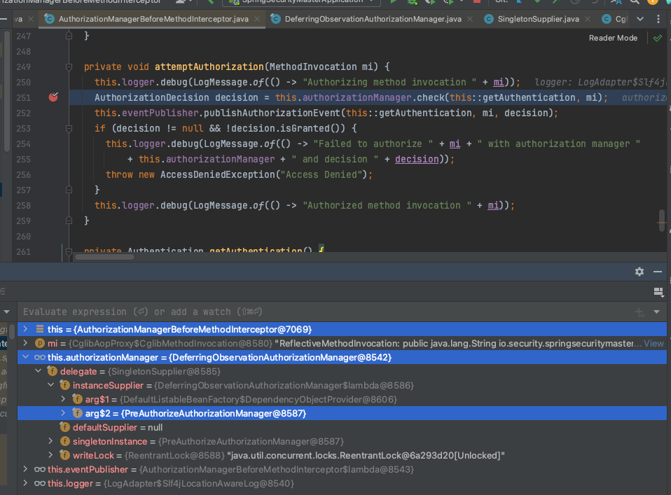
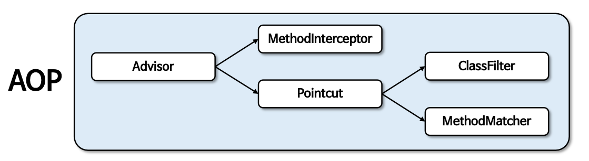
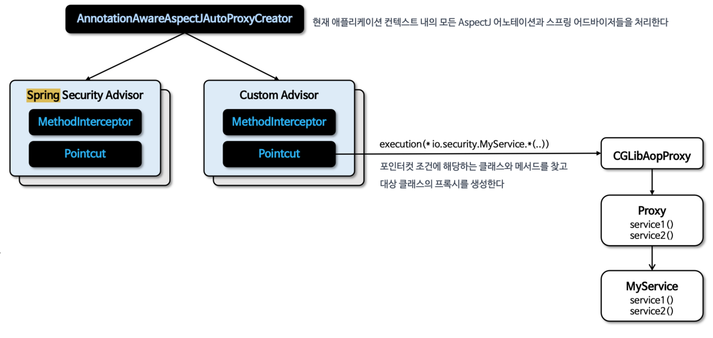

# 인가 아키텍처

## Authorization

***

- 특정 자원에 접근할 수 있는 사람을 결정하는 것을 의미
- GrantedAuthority 클래스를 통해 권한 목록을 관리하며 Authentication 이 GrantedAuthority 를 갖는다.

```java
public interface Authentication extends Principal, Serializable {

  Collection<? extends GrantedAuthority> getAuthorities();
}
```



### GrantedAuthority

***

- GrantedAuthority 는 AuthenticationManager 에 의해 Authentication 객체에 삽입되며 인가 결정을 내릴 때
  AuthenticationManager 를 사용하여 GrantedAuthority 를 체킹

#### 사용자 정의 역할 접두사

***

- default prefix 로 "ROLE_" 를 사용
- GrantedAuthorityDefaults 빈을 정의해서 사용자 커스텀 prefix 가능

## AuthorizationManager

***

- 인증된 사용자가 요청자원에 접근할 수 있는지 여부를 결정하는 인터페이스
- 요청 기반 메서드 인가, 메서드 기반 인가 에서 호출된다.
- AuthorizationFilter 를 통해 AuthorizationManager 호출이 이루어진다.



```java

@FunctionalInterface
public interface AuthorizationManager<T> {

  default void verify(Supplier<Authentication> authentication, T object) {
    AuthorizationDecision decision = check(authentication, object);
    if (decision != null && !decision.isGranted()) {
      throw new AccessDeniedException("Access Denied");
    }
  }

  @Nullable
  AuthorizationDecision check(Supplier<Authentication> authentication, T object);

}

```

### AuthorizationManager 클래스 계층 구조

***


### 요청 기반 인가 관리자

***

- 요청 기반의 인증된 사용자의 자원접근 허용 여부를 결정하는 인가 관리자 클래스
- AuthorityAuthorizationManager, AuthenticatedAuthorizationManager 와 대리자인
  RequestMatcherDelegatingAuthorizationManager 가 있다.

```
// "/user" 엔드포인트 접근(request)은 인증객체(Authentication)에서 "ROLE_USER" 권한(GrantedAuthority)을 필요로 한다.
http.authorizeHttpRequests(
  auth -> auth.requestMatchers("/user").hasRole("USER")
)
```

### HttpSecurity > requestMatchers 설정

***

```
http.authorizeHttpRequests(
  auth -> auth
    .requestMatchers("/user", "/myPage").hasAuthority("USER")
    .requestMatchers("/admin").hasRole("ADMIN")
    .requestMatchers("/db").access(new WebExpressionAuthorizationManager("hasRole('ADMIN') or hasRole('MANAGER')")) 
    .anyRequest().authenticated()
  );
)
```




### AuthenticatedAuthorizationManager 구조

***


- AuthenticatedAuthorizationManager 는 네 개의 AbstractAuthorizationStrategy 내부 구현 클래스를 통해 인증 여부 확인 전략을
  세운다

### AuthenticatedAuthorizationManager 흐름도

***


### AuthorityAuthorizationManager 구조

***

```java
public final class AuthorityAuthorizationManager<T> implements AuthorizationManager<T> {

  private static final String ROLE_PREFIX = "ROLE_";

  private final AuthoritiesAuthorizationManager delegate = new AuthoritiesAuthorizationManager();

  private final Set<String> authorities;

  @Override
  public AuthorizationDecision check(Supplier<Authentication> authentication, T object) {
    return this.delegate.check(authentication, this.authorities); // 권한여부 결정 위임
  }
}
```

- AuthorityAuthorizationManager 는 내부적으로 AuthoritesAuthorizationManager 를 사용하여 권한 여부 결정을 위임한다.

### AuthorityAuthorizationManager 흐름도

***


## 요청 기반 CustomAuthorizationManager 구현

- access(AuthorizationManager) 로 CustomAuthorizationManager 설정
- access() 에 지정한 AuthorizationManager 객체는 RequestMatcherDelegatingAuthorizationManager 의 매핑 속성에 저장

```java
public class CustomAuthorizationManager implements AuthorizationManager<RequestAuthorizationContext> {

  private static final String REQUIRED_ROLE = "ROLE_SECURE";

  @Override
  public AuthorizationDecision check(Supplier<Authentication> authentication, RequestAuthorizationContext object) {
    Authentication auth = authentication.get();
    // 인증 정보가 없거나 인증되지 않은 경우
    if (auth == null || !auth.isAuthenticated() || auth instanceof AnonymousAuthenticationToken) {
      return new AuthorizationDecision(false);
    }
    // "ROLE_SECURE" 권한을 가진 사용자인지 확인
    boolean hasRequiredRole = auth.getAuthorities().stream()
        .anyMatch(grantedAuthority -> REQUIRED_ROLE.equals(grantedAuthority.getAuthority()));

    return new AuthorizationDecision(hasRequiredRole);
  }
}
```

```
http.authorizeHttpRequests(
  auth -> auth.requestMatchers("/user", "/myPage").hasAuthority("USER") 
  .requestMatchers("/admin").hasRole("ADMIN") 
  .requestMatchers("/api").access(new CustomAuthorizationManager())
)
```

## RequestMatcherDelegatingAuthorizationManager 인가 설정

- RequestMatcherDelegatingAuthorizationManager 의 mappings 속성에 직접 RequestMatcherEntry 객체를 생성하고 추가한다.

**- 사용자 RequestMatcher 정의**
```java
  @Bean
  public AuthorizationManager<RequestAuthorizationContext> authorizationManager(HandlerMappingIntrospector introspector){
    List<RequestMatcherEntry<AuthorizationManager<RequestAuthorizationContext>>> mappings = new ArrayList<>();

    RequestMatcherEntry<AuthorizationManager<RequestAuthorizationContext>> requestMatcherEntry1 =
      new RequestMatcherEntry<>(new MvcRequestMatcher(introspector, "/user"),
        AuthorityAuthorizationManager.hasAuthority("ROLE_USER"));

    RequestMatcherEntry<AuthorizationManager<RequestAuthorizationContext>> requestMatcherEntry2 =
      new RequestMatcherEntry<>(new MvcRequestMatcher(introspector, "/db"),
        AuthorityAuthorizationManager.hasAuthority("ROLE_DB"));

    RequestMatcherEntry<AuthorizationManager<RequestAuthorizationContext>> requestMatcherEntry3 =
      new RequestMatcherEntry<>(new MvcRequestMatcher(introspector, "/admin"),
        AuthorityAuthorizationManager.hasRole("ADMIN"));

    RequestMatcherEntry<AuthorizationManager<RequestAuthorizationContext>> requestMatcherEntry4 =
      new RequestMatcherEntry<>(AnyRequestMatcher.INSTANCE, new AuthenticatedAuthorizationManager<>());

    mappings.add(requestMatcherEntry1);
    mappings.add(requestMatcherEntry2);
    mappings.add(requestMatcherEntry3);
    mappings.add(requestMatcherEntry4);

    return new CustomRequestMatcherDelegatingAuthorizationManager(mappings);
  }
```

**- RequestMatcherDelegatingAuthorizationManager 를 갖는 커스텀 객체 정의**

```java
public class CustomRequestMatcherDelegatingAuthorizationManager implements AuthorizationManager<RequestAuthorizationContext> {
    private final RequestMatcherDelegatingAuthorizationManager manager;

    public CustomRequestMatcherDelegatingAuthorizationManager(List<RequestMatcherEntry<AuthorizationManager<RequestAuthorizationContext>>> mappings) {
        manager = RequestMatcherDelegatingAuthorizationManager.builder().mappings(maps -> maps.addAll(mappings)).build();
    }
    @Override
    public AuthorizationDecision check(Supplier<Authentication> authentication, RequestAuthorizationContext object) {
        return manager.check(authentication,object.getRequest());
    }

    @Override
    public void verify(Supplier<Authentication> authentication, RequestAuthorizationContext object) {
        AuthorizationManager.super.verify(authentication, object);
    }
}

```

**- 모든 요청이 CustomRequestMatcherDelegatingAuthorizationManager 가 처리되도록 설정**

```java
http.authorizeHttpRequests(auth -> auth
  .anyRequest().access(
      authorizationManager(null)
        )
```

***
#### 커스텀 변경 된 구조


***
## 메서드 기반 관리자

- 메서드 기반의 인증된 사용자 및 특정 권한을 가진 사용자의 자원 접근 허용 여부를 결정하는 인가 클래스들을 제공
- PreAuthorizeAuthorizationManager, PostAuthorizeAuthorizationManager, Jsr250AuthorizationManager, SecuredAuthorizationManager 가 있다.
- 메서드 기반 권한 부여는 내부적으로 AOP 방식에 의해 초기화 설정이 이루어 지며 메서드의 호출을 MethodInterceptor 가 처리하고 있다.

#### @PreAuthorize

```java
@PreAuthorize("hasAuthority('ROLE_USER')") 
public List<User> users() {
  return userRepositiry.findAll(); 
}
```



***
#### 메서드 권한 부여 초기화 과정


1. 스프링은 초기화 시 생성되는 전체 빈을 검사하면서 빈이 가진 메서드 중에서 보안이 설정된 메서드가 있는지 탐색
2. 보안이 설정된 메서드가 있다면 스프링은 그 빈의 프록시(CGLib 방식) 객체를 생성
3. 보안이 설정된 메서드에는 인가 처리 기능을 하는 Advice 를 등록
4. 스프링은 실제 객체가 아닌 프록시 객체를 빈으로 등록한다.
5. 사용자는 프록시 객체를 통해 메서드를 호출 하고 Advice가 등록된 메서드가 있다면 Advice를 호출 한다.
6. Advice는 메서드 진입 전 인가 처리를 하게 되고 인가 처리가 승인이 되면 실제 객체의 메서드를 호출한다.

***
#### 메서드 인터셉터 구조

- MethodInterceptor
  - AuthorizationManagerBeforeMethodInterceptor : 보안 메서드 호출 가능 여부 검증
  - AuthorizationManagerAfterMethodInterceptor : 보안 메서드 호출 후 반환 가능 여부 검증
  - PreFilterAuthorizationMethodInterceptor : 메서드 파라미터 객체 필터링
  - PostFilterAuthorizationMethodInterceptor : 반환 객체 필터링

***
#### 초기화 과정 구성도


**- AbstractAutoProxyCreator**
- 메서드 보안 설정 메서드를 찾아 프록시 객체를 생성한다.


***
#### @PreAuthorize 처리 구조 이해


**- AuthorizationManagerBeforeMethodInterceptor**

```java
public final class AuthorizationManagerBeforeMethodInterceptor
        implements Ordered, MethodInterceptor, PointcutAdvisor, AopInfrastructureBean {

  @Override
  public Object invoke(MethodInvocation mi) throws Throwable {
    attemptAuthorization(mi);   // 권한검증
    return mi.proceed();        // 실제 객체 메서드 users() 수행
  }

  private void attemptAuthorization(MethodInvocation mi) {
    this.logger.debug(LogMessage.of(() -> "Authorizing method invocation " + mi));
    AuthorizationDecision decision = this.authorizationManager.check(this::getAuthentication, mi);    // 권한 check
    this.eventPublisher.publishAuthorizationEvent(this::getAuthentication, mi, decision);
    if (decision != null && !decision.isGranted()) {
      this.logger.debug(LogMessage.of(() -> "Failed to authorize " + mi + " with authorization manager "
              + this.authorizationManager + " and decision " + decision));
      throw new AccessDeniedException("Access Denied");
    }
    this.logger.debug(LogMessage.of(() -> "Authorized method invocation " + mi));
  }
}  
  
```

**- PreAuthorizeAuthorizationManager**
```java
public final class PreAuthorizeAuthorizationManager implements AuthorizationManager<MethodInvocation> {

  @Override
  public AuthorizationDecision check(Supplier<Authentication> authentication, MethodInvocation mi) {  // @PreAuthorize 표현식 권한 검증
    ExpressionAttribute attribute = this.registry.getAttribute(mi);
    if (attribute == ExpressionAttribute.NULL_ATTRIBUTE) {
      return null;
    }
    EvaluationContext ctx = this.registry.getExpressionHandler().createEvaluationContext(authentication, mi);
    boolean granted = ExpressionUtils.evaluateAsBoolean(attribute.getExpression(), ctx);
    return new ExpressionAuthorizationDecision(granted, attribute.getExpression());
  }
}
```



***

#### @PostAuthorize 처리 구조 이해


```java
public final class AuthorizationManagerAfterMethodInterceptor
		implements Ordered, MethodInterceptor, PointcutAdvisor, AopInfrastructureBean {

  @Override
  public Object invoke(MethodInvocation mi) throws Throwable {
    Object result = mi.proceed();       // AuthorizationManagerBeforeMethodInterceptor 와 순서가 반대로
    attemptAuthorization(mi, result);   // 객체 메서드 수행 후 결과 값 검증
    return result;
  }
}
```

## 메서드 기반 Custom AuthorizationManager 구현


#### @EnableMethodSecurity(prePostEnabled = false)

```java
@EnableMethodSecurity(prePostEnabled = false) // PreAuthorizeAuthorizationManager 같은 기본 제공 클래스 비활성화, 그렇지 않으면 중복 검사 수행 됨
@Configuration
public class MethodSecurityConfig {

    @Bean
    @Role(BeanDefinition.ROLE_INFRASTRUCTURE)
    public Advisor preAuthorize() {
        return AuthorizationManagerBeforeMethodInterceptor.preAuthorize(new MyPreAuthorizationManager());
    }

    @Bean
    @Role(BeanDefinition.ROLE_INFRASTRUCTURE)
    public Advisor postAuthorize() {
        return AuthorizationManagerAfterMethodInterceptor.postAuthorize(new MyPostAuthorizationManager());
    }
}

```

#### MyPreAuthorizationManager

```java
public class MyPreAuthorizationManager implements AuthorizationManager<MethodInvocation> {

  @Override
  public AuthorizationDecision check(Supplier<Authentication> authentication, MethodInvocation invocation) {
    Authentication auth = authentication.get();
    if(auth instanceof AnonymousAuthenticationToken) return new AuthorizationDecision(false);
    return new AuthorizationDecision(auth.isAuthenticated());
  }
}

```

#### MyPostAuthorizationManager

```java
public class MyPostAuthorizationManager implements AuthorizationManager<MethodInvocationResult> {

    @Override
    public AuthorizationDecision check(Supplier<Authentication> authentication, MethodInvocationResult result) {
        Authentication auth = authentication.get();
        if(auth instanceof AnonymousAuthenticationToken) return new AuthorizationDecision(false);
        Account account = (Account) result.getResult();
        boolean isGranted = account.getOwner().equals(auth.getName());
        return new AuthorizationDecision(isGranted);
    }
}

```

***
#### 인터셉터 순서 지정

- 메서드 보안 어노테이션에 설정된 AOP 메서드 인터셉터 순서
  ```java
  public enum AuthorizationInterceptorsOrder {
    FIRST(Integer.MIN_VALUE),
    PRE_FILTER,     //100
    PRE_AUTHORIZE,  //200
    SECURED,        //300
    JSR250,         //400
    POST_AUTHORIZE, //500
    POST_FILTER,    //600
    LAST(Integer.MAX_VALUE);
  }
  ```

- @EnableTransactionManagement AOP 순서
  ```java
  public @interface EnableTransactionManagement {
    boolean proxyTargetClass() default false;
    AdviceMode mode() default AdviceMode.PROXY;
    int order() default Ordered.LOWEST_PRECEDENCE;  // Integer.MAX_VALUE
  }
  ```

- @PostAuthorize 권한검사 후 트랜잭션 rollback 처리를 하려면?
  
  ```java
  @EnableTransactionManagement(order = 0) // @Configuration 클래스에 order 속성 변경해서 선언한다.
  ```
  개인적으로 이런 케이스는 흔하지 않을 거 같다.

## 포인트컷 AOP 메서드 보안
- 어노테이션 기반 AOP가 아닌 PointCut Expression 기반 AOP 로도 메서드 보안 구현이 가능

```java
@EnableMethodSecurity(prePostEnabled = false)
@Configuration
public class MethodSecurityConfig {

    @Bean
    @Role(BeanDefinition.ROLE_INFRASTRUCTURE)
    public Advisor protectServicePointcut() {
        AspectJExpressionPointcut pointcut = new AspectJExpressionPointcut();
        pointcut.setExpression("execution(* io.security.springsecuritymaster.DataService.getUser(..))");
        AuthorityAuthorizationManager<MethodInvocation> manager = hasRole("USER");
        return new AuthorizationManagerBeforeMethodInterceptor(pointcut, manager);
    }

    @Bean
    @Role(BeanDefinition.ROLE_INFRASTRUCTURE)
    public Advisor protectServicePointcut2() {
        return new AuthorizationManagerBeforeMethodInterceptor(createCompositePointcut(), hasRole("USER"));
    }

    public Pointcut createCompositePointcut() {
        AspectJExpressionPointcut pointcut1 = new AspectJExpressionPointcut();
        pointcut1.setExpression("execution(* io.security.springsecuritymaster.DataService.getUser(..))");

        AspectJExpressionPointcut pointcut2 = new AspectJExpressionPointcut();
        pointcut2.setExpression("execution(* io.security.springsecuritymaster.DataService.getOwner(..))");

        // 두 포인트컷을 조합
        ComposablePointcut compositePointcut = new ComposablePointcut((Pointcut) pointcut1);
        compositePointcut.union((Pointcut) pointcut2);

        return compositePointcut;
    }
}

```

## AOP 메서드 보안 구현

- MethodInterceptor, Pointcut, Advisor, AuthorizationManager 등을 커스텀하게 생성하여 AOP 메서드 보안을 구현 할 수 있다

#### AOP 요소 이해

- Advisor
  - AOP Advice 와 Advice 적용 가능성을 결정하는 포인트컷을 가진 기본 인터페이스

- MethodInterceptor(Advice)
  - 대상 객체를 호출하기 전과 후에 추가 작업을 수행하기 위한 인터페이스
  - 추가 작업 수행 이후 실제 대상 객체의 조인포인트 호출(메서드 호출)을 위해 Joinpoint.proceed()를 호출

- PointCut
  - AOP 에서 Advice가 적용될 메서드나 클래스를 정의
  - Advice 가 실행되어야 하는 '적용시점' 이나 '조건'을 지정
  - ClassFilter 와 MethodMatcher 를 사용해서 어떤 클래스/메서드에 Advice를 적용할 것인지를 결정



#### AOP 초기화

- AnnotationAwareAspectJAutoProxyCreator
  - AspectJ 어노테이션과 스프링 어드바이저를 처리
  <br><br>
  

#### AOP 적용순서
1. CustomMethodInterceptor 를 생성하고 메서드 보안 검사를 수행할 AuthorizationManager 를 CustomMethodInterceptor 에 전달
2. CustomPointcut을 생성하고 프록시 대상 클래스와 대상 메서드를 결정할 수 있도록 포인트컷 표현식을 정의
3. DefaultPointAdvisor 를 생성하고 CustomMethodInterceptor 와 CustomPointcut 을 설정한다.
4. 서비스를 호출하면 Pointcut 으로부터 대상 클래스와 대상 메서드에 등록된 AOP를 수행한다.

**- MethodSecurityConfig**

```java
@EnableMethodSecurity(prePostEnabled = false)
@Configuration
public class MethodSecurityConfig {

    @Bean
    public MethodInterceptor customMethodInterceptor() {
        AuthorizationManager<MethodInvocation> authorizationManager = AuthenticatedAuthorizationManager.authenticated();
        return new CustomMethodInterceptor(authorizationManager);   // AOP Advice 선언
    }

    @Bean
    public Pointcut pointcut() {
        AspectJExpressionPointcut pointcut = new AspectJExpressionPointcut();
        pointcut.setExpression("execution(* io.security.springsecuritymaster.DataService.*(..))");
        return pointcut;  // AOP 수행 대상 클래스, 메서드 지정
    }

    @Bean
    public Advisor serviceAdvisor() {
        return new DefaultPointcutAdvisor(pointcut(), customMethodInterceptor());   // Advisor 등록
    }
}

```

**- CustomMethodInterceptor**

```java
public class CustomMethodInterceptor implements MethodInterceptor {
    private final AuthorizationManager<MethodInvocation> authorizationManager;

    public CustomMethodInterceptor(AuthorizationManager<MethodInvocation> authorizationManager) {
        this.authorizationManager = authorizationManager;
    }

    @Override
    public Object invoke(MethodInvocation invocation) throws Throwable {
        Authentication authentication = SecurityContextHolder.getContext().getAuthentication();
        if (authorizationManager.check(() -> authentication, invocation).isGranted()) {
            return invocation.proceed();    // 실제 대상 겍체 메서드 호출
        } else {
            throw new AccessDeniedException("Access Denied");
        }
    }
}

```