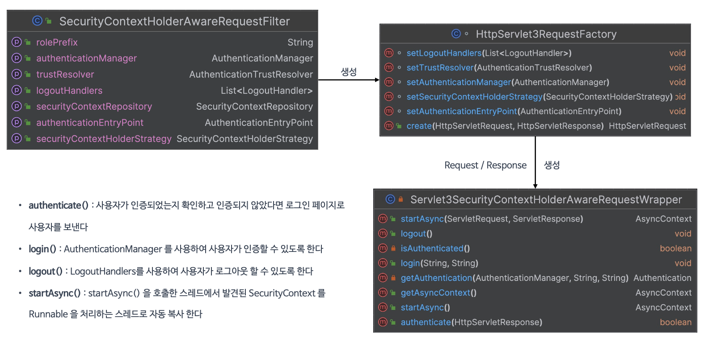
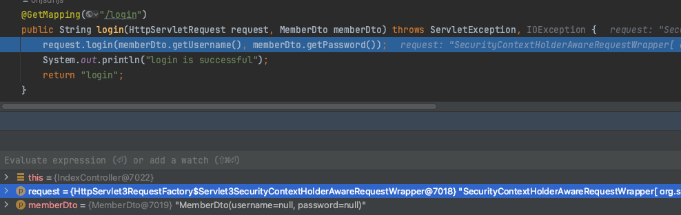
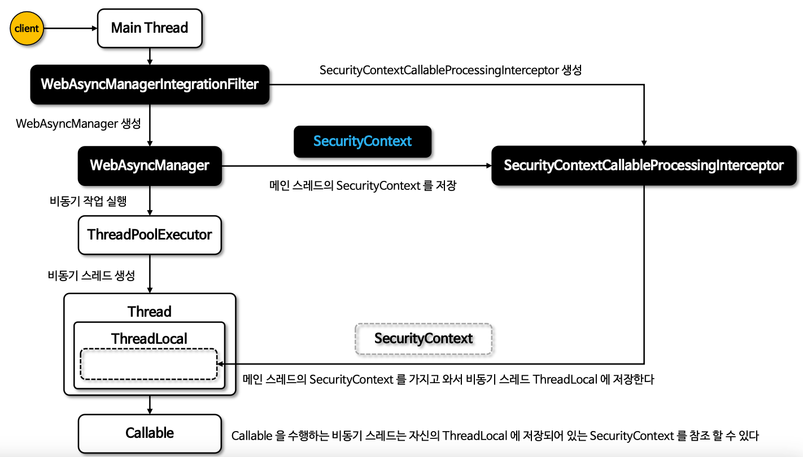

# 통합하기

### Servlet 3.0 API 통합하기

- Servlet 3.0 과 Spring MVC 와 통합해서 여러 편리한 기능 제공
- 인증 관련 기능을 필터가 아닌 서블릿 영역에서 처리 가능

***
### Servlet 3.0 통합

1. SecurityContextHolderAwareRequestFilter
    - HTTP 요청이 처리될 때 HttpServletRequest 에 보안 관련 메서드를 추가 해주는 SecurityContextHolderAwareRequestWrapper 클래스를 적용하는 HttpServlet3RequestFactory 클래스 생성
    ```java
    private HttpServletRequestFactory createServlet3Factory(String rolePrefix) {
   
            HttpServlet3RequestFactory factory = new HttpServlet3RequestFactory(rolePrefix, this.securityContextRepository);
            factory.setTrustResolver(this.trustResolver);
            factory.setAuthenticationEntryPoint(this.authenticationEntryPoint);
            factory.setAuthenticationManager(this.authenticationManager);
            factory.setLogoutHandlers(this.logoutHandlers);
            factory.setSecurityContextHolderStrategy(this.securityContextHolderStrategy);
   
            return factory;
    }
    ```
2. HttpServlet3RequestFactory
    - Servlet 3.0 API 와의 통합 하기 위한 Servlet3SecurityContextHolderAwareRequestWrapper 생성
   ```java
    @Override
    public HttpServletRequest create(HttpServletRequest request, HttpServletResponse response) {
      Servlet3SecurityContextHolderAwareRequestWrapper wrapper = new Servlet3SecurityContextHolderAwareRequestWrapper(request, this.rolePrefix, response);
      wrapper.setSecurityContextHolderStrategy(this.securityContextHolderStrategy);
      
      return wrapper;
    }
    ```

3. Servlet3SecurityContextHolderAwareRequestWrapper
    - HttpServletRequset 의 래퍼 클래스로서 Servlet 3.0 기능을 지원하면서 동시에 SecurityContextHolder 와의 통합 제공
    - 비동기 처리로 SecurityContext에 접근 가능
   ```java
    // HttpServlet3RequestFactory 내부 클래스
    private class Servlet3SecurityContextHolderAwareRequestWrapper extends SecurityContextHolderAwareRequestWrapper {
      private final HttpServletResponse response;

      Servlet3SecurityContextHolderAwareRequestWrapper(HttpServletRequest request, String rolePrefix, HttpServletResponse response) {
        super(request, HttpServlet3RequestFactory.this.trustResolver, rolePrefix);
        this.response = response;
      }  
      //...(중략)
    }
    ```

***
### 구조 및 API



***
### 코드 구현

- HttpServletRequest >> HttpServlet3RequestFactory$SecurityContextHolderAwareRequestWrapper
   

- request.login
- request.authenticate

```java
@GetMapping("/login")
public String login(HttpServletRequest request, MemberDto memberDto) throws ServletException, IOException {
  request.login(memberDto.getUsername(), memberDto.getPassword());
  System.out.println("login is successful");
  return "login";
}

@GetMapping("/users")
public List<MemberDto> users(HttpServletRequest request, HttpServletResponse response) throws ServletException, IOException {
  boolean authenticate = request.authenticate(response);
  if (authenticate) {
      return List.of(new MemberDto("user","1111"));
  }
  return Collections.emptyList();
}
```

***
### @AuthenticationPrincipal

- Authentication.getPrincipal() 을 @AuthenticationPricipal 어노테이션 형태로 지원 하도록 AuthenticationPrincipalArgumentResolver 제공

```java
// 1. Authentication.getPrincipal() 사용
@GetMapping("/user")
public User user(){
  Authentication authentication = SecurityContextHolder.getContextHolderStrategy().getContext().getAuthentication();
  return authentication == null ? null : (User)authentication.getPrincipal();
}
// 2. @AuthenticationPrincipal 사용
@GetMapping("/user2")
public User user2(@AuthenticationPrincipal User user){
  return user;
}
```

***
### @AuthenticationPrincipal(expression= \"\")

```java
//User.username 반환
@GetMapping("/username")
public String username(@AuthenticationPrincipal(expression = "username") String username){
  return username;
}
```

***
### @AuthenticationPrincipal 메타 주석

```java
@Target({ ElementType.PARAMETER, ElementType.TYPE })
@Retention(RetentionPolicy.RUNTIME)
@Documented
@AuthenticationPrincipal
public @interface CurrentUser {
}

// @CurrentUser 사용자 정의 인터페이스 사용
@GetMapping("/user3")
public User user3(@CurrentUser User user){
   return user;
}
```

***
### Spring MVC 비동기 통합

- WebAsyncManager 와 통합하여 Callable 을 실행하는 비동기 스레드에 SecurityContext 를 자동 설정 지원
- @Async 방식의 어노테이션 비동기 스레드는 지원하지 않는다.
- WebAsyncManagerIntegrationFilter
  - SecurityContext 와 WebAsyncManager 사이의 통합을 제공
  - WebAsyncManager를 생성, SecurityContextCallableProcessingInterceptor 를 WebAsyncManager 에 등록
   ```java
   @Override
   protected void doFilterInternal(HttpServletRequest request, HttpServletResponse response, FilterChain filterChain)
         throws ServletException, IOException {
  
     WebAsyncManager asyncManager = WebAsyncUtils.getAsyncManager(request);
     SecurityContextCallableProcessingInterceptor securityProcessingInterceptor = (SecurityContextCallableProcessingInterceptor) asyncManager
         .getCallableInterceptor(CALLABLE_INTERCEPTOR_KEY);
  
     if (securityProcessingInterceptor == null) {
         SecurityContextCallableProcessingInterceptor interceptor = new SecurityContextCallableProcessingInterceptor();
         interceptor.setSecurityContextHolderStrategy(this.securityContextHolderStrategy);
         asyncManager.registerCallableInterceptor(CALLABLE_INTERCEPTOR_KEY, interceptor);
     }
  
     filterChain.doFilter(request, response);
   }
   ```
- WebAsyncManager
  - Callable 을 받아 비동기 스레드 실행
  - 등록된 SecurityContextCallableProcessingInterceptor 를 통해 현재 스레드가 보유하고 있는 SecurityContext 객체를 비동기 스레드의 ThreadLocal에 저장
   ```java
   //WebAsyncManager.applyPreProcess
   public void applyPreProcess(NativeWebRequest request, Callable<?> task) throws Exception {
     for (CallableProcessingInterceptor interceptor : this.interceptors) {
         interceptor.preProcess(request, task); //SecurityContextCallableProcessingInterceptor.preProcess 메서드 호출
         this.preProcessIndex++;
     }
   }
  
   //SecurityContextCallableProcessingInterceptor.preProcess
   @Override
   public <T> void preProcess(NativeWebRequest request, Callable<T> task) {
     this.securityContextHolderStrategy.setContext(this.securityContext);
   }
   ```
  


***
### 코드 구현

```java
// Callable 인터페이스 비동기 스레드는 SecurityContext 지원
@GetMapping("/callable")
public Callable<Authentication> callable() {
  SecurityContext securityContext = SecurityContextHolder.getContextHolderStrategy().getContext();
  System.out.println("securityContext = " + securityContext);
  System.out.println("Parent Thread: " + Thread.currentThread().getName());

  return new Callable<Authentication>() {
      public Authentication call() throws Exception {
          //비동기 스레드 영역
          SecurityContext securityContext = SecurityContextHolder.getContextHolderStrategy().getContext();
          System.out.println("securityContext = " + securityContext);
          System.out.println("Child Thread: " + Thread.currentThread().getName());
          Authentication authentication = securityContext.getAuthentication();

          return authentication;
      }
  };
}

// @Async 는 지원하지 않음.
@GetMapping("/async")
public Authentication async() {
  
  SecurityContext securityContext = SecurityContextHolder.getContextHolderStrategy().getContext();
  System.out.println("securityContext = " + securityContext);
  System.out.println("Parent Thread: " + Thread.currentThread().getName());
  asyncService.asyncMethod();
  
  return securityContext.getAuthentication();
}
```