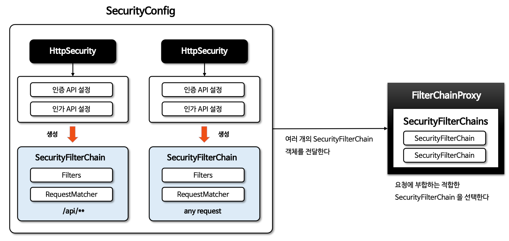
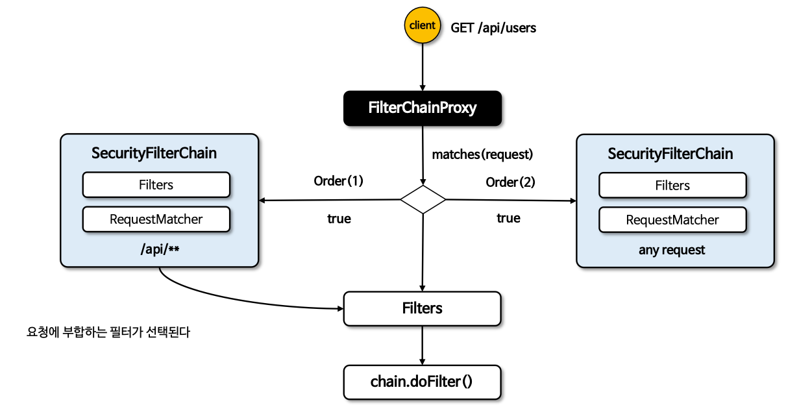

# 고급설정

## 다중 보안 설정
- 여러 SecurityFilterChain 을 Bean으로 등록해서 다중 보안 기능을 구성 할 수 있다.

```java
// 1순위
@Bean
@Order(1)
public SecurityFilterChain securityFilterChain2(HttpSecurity http) throws Exception {
    http
      .securityMatchers((matchers) ->
        matchers.requestMatchers("/api/**")
      )
      .authorizeHttpRequests(authorize ->
        authorize.anyRequest().permitAll()
      );

    return http.build();
}

// 2순위
@Bean
public SecurityFilterChain securityFilterChain(HttpSecurity http, ApplicationContext context) throws Exception {

  http
    .authorizeHttpRequests(authorize -> authorize
      .requestMatchers("/login").permitAll()
      .anyRequest().authenticated()
    )
    .formLogin(Customizer.withDefaults());

  return http.build();
}
```

***
### 다중 보안 설정 초기화 구성



***
### 다중 보안 설정 요청 흐름도



- HttpSecurity 인스턴스 별로 보안 기능 동작
- 요청에 따라 RequestMatcher 와 매칭 되는 필터 동작

## Custom DSLs
- 사용자 정의 DSL 구현 가능
- DSL을 구성하면 필터, 핸들러, 메서드, 속성 등을 한 곳에 정의 가능

***
### AbstractHttpConfigurer<AbstractHttpConfigurer, HttpSecurityBuilder>
- 사용자 DSL 을 구현하기 위해서 상속 받는 추상 클래스
    ```java
    public class MyCustomDsl extends AbstractHttpConfigurer<MyCustomDsl, HttpSecurity> {
        private boolean flag;
  
        @Override
        public void init(HttpSecurity http) throws Exception {
            super.init(http);
        }
  
        @Override
        public void configure(HttpSecurity http) throws Exception {
            MyCustomFilter myCustomFilter = new MyCustomFilter();
            myCustomFilter.setFlag(flag);
            http.addFilterAfter(myCustomFilter, SecurityContextHolderAwareRequestFilter.class);
        }
  
        public MyCustomDsl flag(boolean value) {
            this.flag = value;
            return this;
        }
  
        public static MyCustomDsl customDsl() {
            return new MyCustomDsl();
        }
    }
    ```
- MyCustomFilter : 사용자 정의 필터 구현
  ```java
  public class MyCustomFilter extends OncePerRequestFilter {
      private boolean flag;
      @Override
      protected void doFilterInternal(HttpServletRequest request, HttpServletResponse response, FilterChain filterChain) throws ServletException, IOException {
          if(flag){
              try {
                  request.login("user", "1111");  //로그인 수행을 위해 SecurityContextHolderAwareRequestFilter 필터 뒤에 위치
              }catch(Exception e){
                  System.out.println(e.getMessage());
              }
              flag = false;
          }
          filterChain.doFilter(request,response);
      }
  
      public void setFlag(boolean flag){
          this.flag = flag;
      }
  }
  ```

- HttpSecurity.with(C configurer, Customizer<C> customizer) : Custom DSL 설정

  ```java
  @Bean
  public SecurityFilterChain securityFilterChain(HttpSecurity http, ApplicationContext context) throws Exception {
  
      http
              .authorizeHttpRequests(authorize -> authorize
                      .requestMatchers("/user").hasAuthority("ROLE_USER")
                      .requestMatchers("/db").hasAuthority("ROLE_DB")
                      .requestMatchers("/admin").hasAuthority("ROLE_ADMIN")
                      .anyRequest().authenticated())
              .formLogin(Customizer.withDefaults())
              .with(MyCustomDsl.customDsl(), dsl -> dsl.flag(false));     // custom DSL 설정
  
      return http.build();
  }
  ```

## 이중화 설정

- 레디스 세션 서버를 통해 여러 서버 간 세션 공유 가능

  ```java
  @Configuration
  @EnableRedisHttpSession
  public class RedisConfig {
  
      @Value("${spring.data.redis.host}")
      private String host;
  
      @Value("${spring.data.redis.port}")
      private int port;
  
      @Bean
      public RedisConnectionFactory redisConnectionFactory() {
          return new LettuceConnectionFactory(host, port);
      }
  }
  ```
