# 인증 프로세스

◼︎ 폼 인증

- HTTP 기반의 폼 로그인 인증 메커니즘을 활성화 하는 API
- 기본적으로 스프링 시큐리티가 제공하는 로그인 페이지 사용

◼︎ 폼 인증 흐름
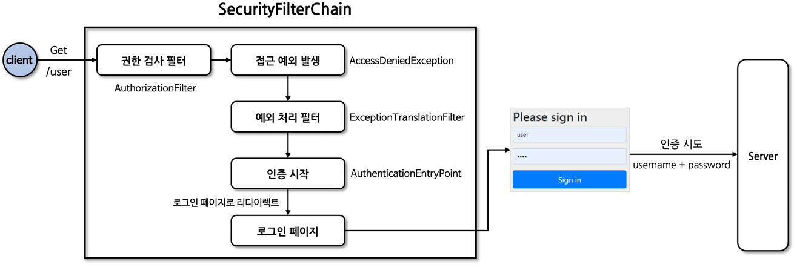

◼︎ formLogin() API

- FormLoginConfigurer 설정 클래스를 통해 여러 API 들을 설정할 수 있다.
- 내부적으로 UsernamePasswordAuthenticationFilter가 생성되어 폼 방식의 인증 처리를 담당한다.

```java
public final class HttpSecurity extends
    AbstractConfiguredSecurityBuilder<DefaultSecurityFilterChain, HttpSecurity>
    implements SecurityBuilder<DefaultSecurityFilterChain>, HttpSecurityBuilder<HttpSecurity> {

  public HttpSecurity formLogin(Customizer<FormLoginConfigurer<HttpSecurity>> formLoginCustomizer)
      throws Exception {
    formLoginCustomizer.customize(getOrApply(new FormLoginConfigurer<>())); //FormLoginConfigurer 생성
    return HttpSecurity.this;
  }
}

public final class FormLoginConfigurer<H extends HttpSecurityBuilder<H>> extends
    AbstractAuthenticationFilterConfigurer<H, FormLoginConfigurer<H>, UsernamePasswordAuthenticationFilter> {

  public FormLoginConfigurer() {
    super(new UsernamePasswordAuthenticationFilter(),
        null);  //UsernamePasswordAuthenticationFilter 생성
    usernameParameter("username");
    passwordParameter("password");
  }
}
```

◼︎ UsernamePasswordAuthenticationFilter

- 스프링 시큐리티는 AbstractAuthenticationProcessingFilter 클래스를 사용자의 자격증명을 인증하는 기본 필터로 사용한다.
- UsernamePasswordAuthenticationFilter는 AbstractAuthenticationProcessingFilter를 확장한 클래스로서 사용자 이름과
  비밀번호 인증을 수행한다.
- 인증 프로세스가 초기화 될 때 로그인 페이지와 로그아웃 페이지 생성을 위한 DefaultLoginPageGeneratingFilter와
  DefaultLogoutPageGeneratingFilter가 초기화 된다.

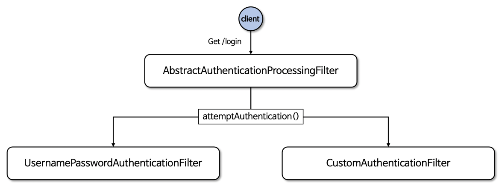

◼︎ 흐름도
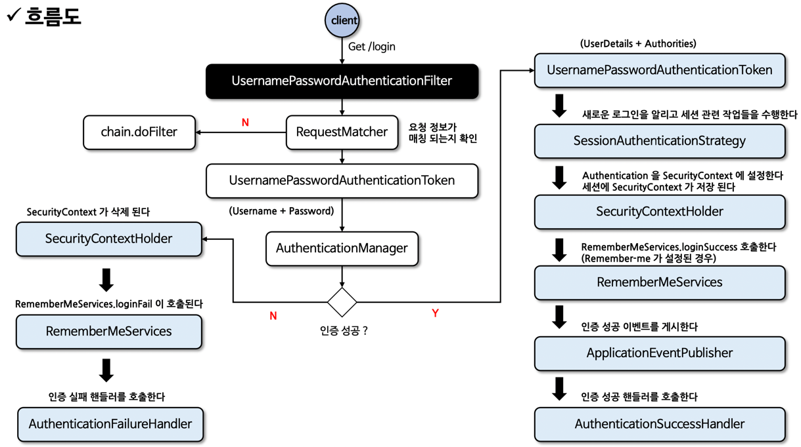

```java
public abstract class AbstractAuthenticationProcessingFilter extends GenericFilterBean
    implements ApplicationEventPublisherAware, MessageSourceAware {

  /**
   * process 1) requiresAuthentication 
   *    : RequestMatcher 수행
   *
   * process 2) UsernamePasswordAuthenticationFilter > attemptAuthentication
   *    : UsernamePasswordAuthenticationToken (username + password) 생성
   *      process 2-1) AuthenticationManager(ProviderManager) authenticate 메서드 호출
   *         : (AbstractUserDetailsAuthenticationProvider)provider.authenticate 메서드 >> createSuccessAuthentication 메서드
   *         : UsernamePasswordAuthenticationToken (UserDetails + Authorities) 생성
   *
   * process 3) successfulAuthentication
   *    : SecurityContext 생성
   *    : SecurityContext에 UsernamePasswordAuthenticationToken(UserDetails + Authorities)을 담는다.
   *    : 세션 스토리지에 save SecurityContext 
   *
   * error-process unsuccessfulAuthentication
   *    : 인증 실패하면 BadCridentialsException : 자격증명에 실패하였습니다. 오류 발생
   *    : unsuccessfulAuthentication 메서드 호출
   *      >> 세션 SecurityContext 비우기
   *      >> 인증실패 핸들러(AuthenticcationFailureHandler) 호출
   *
   * @param request
   * @param response
   * @param chain
   * @throws IOException
   * @throws ServletException
   */
  private void doFilter(HttpServletRequest request, HttpServletResponse response, FilterChain chain)
      throws IOException, ServletException {
    if (!requiresAuthentication(request, response)) {
      chain.doFilter(request, response);
      return;
    }
    try {
      Authentication authenticationResult = attemptAuthentication(request, response);
      if (authenticationResult == null) {
        // return immediately as subclass has indicated that it hasn't completed
        return;
      }
      this.sessionStrategy.onAuthentication(authenticationResult, request, response);
      // Authentication success
      if (this.continueChainBeforeSuccessfulAuthentication) {
        chain.doFilter(request, response);
      }
      successfulAuthentication(request, response, chain, authenticationResult);
    } catch (InternalAuthenticationServiceException failed) {
      this.logger.error("An internal error occurred while trying to authenticate the user.",
          failed);
      unsuccessfulAuthentication(request, response, failed);
    } catch (AuthenticationException ex) {
      // Authentication failed
      unsuccessfulAuthentication(request, response, ex);
    }
  }

  protected void successfulAuthentication(HttpServletRequest request, HttpServletResponse response,
      FilterChain chain,
      Authentication authResult) throws IOException, ServletException {
    SecurityContext context = this.securityContextHolderStrategy.createEmptyContext();
    context.setAuthentication(authResult);
    this.securityContextHolderStrategy.setContext(context);
    this.securityContextRepository.saveContext(context, request, response);
    if (this.logger.isDebugEnabled()) {
      this.logger.debug(LogMessage.format("Set SecurityContextHolder to %s", authResult));
    }
    this.rememberMeServices.loginSuccess(request, response, authResult);
    if (this.eventPublisher != null) {
      this.eventPublisher.publishEvent(
          new InteractiveAuthenticationSuccessEvent(authResult, this.getClass()));
    }
    this.successHandler.onAuthenticationSuccess(request, response, authResult);
  }
}

public class UsernamePasswordAuthenticationFilter extends AbstractAuthenticationProcessingFilter {

  @Override
  public Authentication attemptAuthentication(HttpServletRequest request,
      HttpServletResponse response)
      throws AuthenticationException {
    if (this.postOnly && !request.getMethod().equals("POST")) {
      throw new AuthenticationServiceException(
          "Authentication method not supported: " + request.getMethod());
    }
    String username = obtainUsername(request);
    username = (username != null) ? username.trim() : "";
    String password = obtainPassword(request);
    password = (password != null) ? password : "";
    UsernamePasswordAuthenticationToken authRequest = UsernamePasswordAuthenticationToken.unauthenticated(
        username,
        password);
    // Allow subclasses to set the "details" property
    setDetails(request, authRequest);
    return this.getAuthenticationManager().authenticate(authRequest);
  }
}
```

◼︎ HTTP Basic 인증

- HTTP는 엑세스 제어와 인증을 위한 프레임워크르 제공하며 가장 일반적인 인증 방식은 "Basic" 인증방식이다.
- RFC7235가 표준이며 인증 프로토콜은 HTTP 인증 헤더에 기술되어 있다.

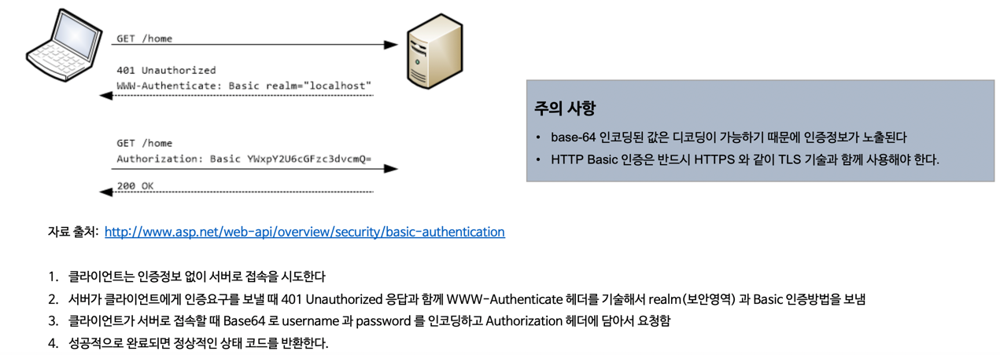

◼︎ httpBasic() API

- httpBasicConfigurer 설정 클래스를 통해 여러 API 들을 설정할 수 있다.
- 내부적으로 BasicAuthenticationFilter가 생성되어 기본 인증 방식의 인증 처리를 담당하게 된다.

◼︎ BasicAuthenticationFilter

- 이 필터는 기본 인증 서비스를 제공하는데 사용
- BasicAuthenticationConverter 를 사용해서 요청 헤더에 기술된 인증정보의 유효성을 체크, Base64 인코딩된 username과 password를
  추출한다.
- 인증 이후 세션을 사용하는 경우와 사용하지 않는 경우에 따라 흐름 차이가 있다.
  세션을 사용하는 경우 매 요청마다 인증과정을 거치지 않으나 세션을 사용하지 않는 경우 매 요청마다 인증과정을 거쳐야 한다.

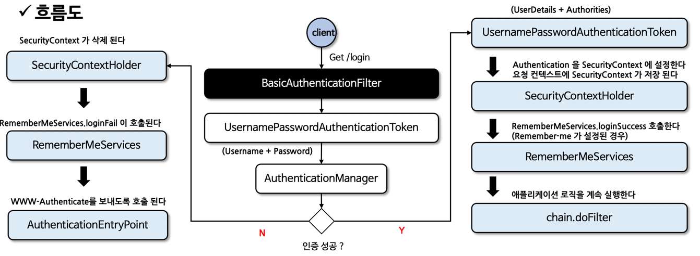

```java
/**
 * OncePerRequestFilter
 * 한번의 요청에 한번만 수행되는 필터
 * ex) 특정 url로 forwarding을 수행할 때 해당 필터가 수행 되었다면 다시 수행되지 않음
 */
public class BasicAuthenticationFilter extends OncePerRequestFilter {

  @Override
  protected void doFilterInternal(HttpServletRequest request, HttpServletResponse response,
      FilterChain chain)
      throws IOException, ServletException {
    try {
      Authentication authRequest = this.authenticationConverter.convert(request);
      if (authRequest == null) {
        this.logger.trace("Did not process authentication request since failed to find "
            + "username and password in Basic Authorization header");
        chain.doFilter(request, response);
        return;
      }
      String username = authRequest.getName();
      this.logger.trace(
          LogMessage.format("Found username '%s' in Basic Authorization header", username));
      if (authenticationIsRequired(username)) {
        Authentication authResult = this.authenticationManager.authenticate(authRequest);
        SecurityContext context = this.securityContextHolderStrategy.createEmptyContext();
        context.setAuthentication(authResult);
        this.securityContextHolderStrategy.setContext(context);
        if (this.logger.isDebugEnabled()) {
          this.logger.debug(LogMessage.format("Set SecurityContextHolder to %s", authResult));
        }
        this.rememberMeServices.loginSuccess(request, response, authResult);
        this.securityContextRepository.saveContext(context, request, response);
        onSuccessfulAuthentication(request, response, authResult);
      }
    } catch (AuthenticationException ex) {
      this.securityContextHolderStrategy.clearContext();
      this.logger.debug("Failed to process authentication request", ex);
      this.rememberMeServices.loginFail(request, response);
      onUnsuccessfulAuthentication(request, response, ex);
      if (this.ignoreFailure) {
        chain.doFilter(request, response);
      } else {
        this.authenticationEntryPoint.commence(request, response, ex);
      }
      return;
    }

    chain.doFilter(request, response);
  }
}
```

◼︎ RememberMe 인증

- 사용자가 웹사이트나 어플리케이션에 로그인 할 때 자동으로 인증정보를 기억하는 기능
- UsernamePasswordAuthenticationFilter와 함께 사용되며, AbstractAuthenticationProcessingFilter 슈퍼클래스에서 훅을
  통해 구현
    - 인증 성공 시 RememberMeServices.loginSuccess()를 통해 RememberMe 토큰을 생성하고 쿠키로 전달한다.
    - 인증 실패 시 RememberMeServices.loginFail()를 통해 쿠키를 지운다.
    - LogoutFilter와 연계해서 로그아웃 시 쿠키를 지운다.

◼︎ 토큰 생성

- 기본적으로 암호화된 토큰으로 생성되며 브라우저에서 쿠키를 보내고, 향후 세션에서 이 쿠키를 감지하여 자동 로그인이 이루어지는 방식
    - base64(username + ":" + expirationTime + ":" + algorithmName + ":" algorithmHex(
      username + ":" + expirationTime + ":" password + ":" + key))

◼︎ RememberMeServices 구현체

- TokenBasedRememberMeServices : 쿠키 기반 토큰의 보안을 위해 해싱
- PersistentTokenBasedRememberMeServices : 데이터베이스 기반으로 토큰 save
- 두 구현 모두 사용자의 정보를 검색하기 위한 UserDetailsService가 필요

◼︎ rememberMe()

- RememberMeConfigurer 설정 클래스를 통해 여러 API 들을 설정할 수 있다.
- 내부적으로 RememberMeAuthenticationFilter가 생성되어 자동 인증 처리를 담당

◼︎ RememberMeAuthenticationFilter

- SecurityContextHolder 에 Authentication이 포함되지 않은 경우 실행되는 필터
- 세션이 만료되었거나 어플리케이션 종료로 인해 인증 상태가 소멸된 경우 토큰 기반 인증을 사용해 유효성을 검사 후 자동 로그인 처리

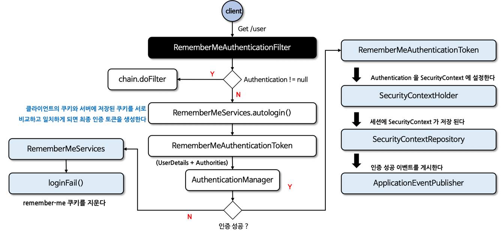

```java
/**
 * (UsernamePasswordAuthenticationFilter)AbstractAuthenticationProcessingFilter > 로그인 인증 성공 > successfulAuthentication 메서드 호출
 * > rememberMeServices.loginSuccess 메서드 호출 > (PersistentTokenBasedRememberMeServices)AbstractRememberMeServices onLoginSuccess 메서드 호출
 *
 * - 암호화된 Token 서버 메모리에 save
 * - client 에게 setCookie 응답
 */
public class PersistentTokenBasedRememberMeServices extends AbstractRememberMeServices {

  @Override
  protected void onLoginSuccess(HttpServletRequest request, HttpServletResponse response,
      Authentication successfulAuthentication) {
    String username = successfulAuthentication.getName();
    this.logger.debug(LogMessage.format("Creating new persistent login for user %s", username));
    PersistentRememberMeToken persistentToken = new PersistentRememberMeToken(username,
        generateSeriesData(),
        generateTokenData(), new Date());
    try {
      this.tokenRepository.createNewToken(persistentToken);
      addCookie(persistentToken, request, response);
    } catch (Exception ex) {
      this.logger.error("Failed to save persistent token ", ex);
    }
  }
}

/**
 * 인증이 안 되어 있을 때 RememberMeAuthenticationFilter 수행
 * client로 입력 받은 쿠키로 RememberMeAuthenticationToken(UserDetails + Authorities) 생성
 * SecurityContext 생성 > 세션 save
 */
public class RememberMeAuthenticationFilter extends GenericFilterBean implements
    ApplicationEventPublisherAware {

  private void doFilter(HttpServletRequest request, HttpServletResponse response, FilterChain chain)
      throws IOException, ServletException {
    if (this.securityContextHolderStrategy.getContext().getAuthentication() != null) {
      this.logger.debug(LogMessage
          .of(() ->
              "SecurityContextHolder not populated with remember-me token, as it already contained: '"
                  + this.securityContextHolderStrategy.getContext().getAuthentication() + "'"));
      chain.doFilter(request, response);
      return;
    }
    Authentication rememberMeAuth = this.rememberMeServices.autoLogin(request, response);
    if (rememberMeAuth != null) {
      // Attempt authentication via AuthenticationManager
      try {
        rememberMeAuth = this.authenticationManager.authenticate(rememberMeAuth);
        // Store to SecurityContextHolder
        SecurityContext context = this.securityContextHolderStrategy.createEmptyContext();
        context.setAuthentication(rememberMeAuth);
        this.securityContextHolderStrategy.setContext(context);
        onSuccessfulAuthentication(request, response, rememberMeAuth);
        this.logger.debug(
            LogMessage.of(() -> "SecurityContextHolder populated with remember-me token: '"
                + this.securityContextHolderStrategy.getContext().getAuthentication() + "'"));
        this.securityContextRepository.saveContext(context, request, response);
        if (this.eventPublisher != null) {
          this.eventPublisher.publishEvent(new InteractiveAuthenticationSuccessEvent(
              this.securityContextHolderStrategy.getContext().getAuthentication(),
              this.getClass()));
        }
        if (this.successHandler != null) {
          this.successHandler.onAuthenticationSuccess(request, response, rememberMeAuth);
          return;
        }
      } catch (AuthenticationException ex) {
        this.logger.debug(LogMessage
                .format(
                    "SecurityContextHolder not populated with remember-me token, as AuthenticationManager "
                        + "rejected Authentication returned by RememberMeServices: '%s'; "
                        + "invalidating remember-me token", rememberMeAuth),
            ex);
        this.rememberMeServices.loginFail(request, response);
        onUnsuccessfulAuthentication(request, response, ex);
      }
    }
    chain.doFilter(request, response);
  }
}
```

◼︎ 익명사용자

- "익명으로 인증된" 사용자와 인증되지 않은 사용자 간에 실제 개념적 차이는 없으며 단지 엑세스 제어 속성을 구성하는 편리한 방법을 제공
- SecurityContextHolder가 항상 Authentication 객체를 포함하고 null을 포함하지 않는다는 것을 규칙
- 인증 사용자와 익명 인증 사용자를 구분해서 어떤 기능을 수행하고자 할 때 유용하며 익명 인증 객체는 세션에 저장하지 않는다.
- 익명 인증 사용자의 권한을 별도로 운용할 수 있다. 즉 인증 된 사용자가 접근할 수 없도록 구성이 가능하다.

```java

@EnableWebSecurity
@Configuration
public class SecurityConfig {

  @Bean
  public SecurityFilterChain securityFilterChain(HttpSecurity http) throws Exception {
    http
        .authorizeHttpRequests(auth -> auth
            .requestMatchers("/anonymous")
            .hasRole("GUEST")                       // anonymous URL은 인증되지 않은 사용자(GUEST)만 접근 가능
            .requestMatchers("/anonymousContext", "/authentication")
            .permitAll()
            .anyRequest()
            .authenticated()
        )
        .formLogin(Customizer.withDefaults())
        .anonymous(anonymous -> anonymous
            .principal("guest")
            .authorities("ROLE_GUEST")
        );

    return http.build();
  }
}
```

◼︎ 스프링 MVC에서 익명 인증 사용하기

- 익명 요청에서 Authentication 을 얻고 싶다면 @CurrentSecurityContext를 사용

```java

@RestController
public class IndexController {

  @GetMapping("/anonymousContext")
  public String anonymousContext(@CurrentSecurityContext SecurityContext context) {
    return context.getAuthentication().getName();
  }
}
```

◼ AnonymousAuthenticationFilter

- SecurityContextHolder 에 Authentication 객체가 없을 경우 새로운 Authentication 객체로 채운다.

︎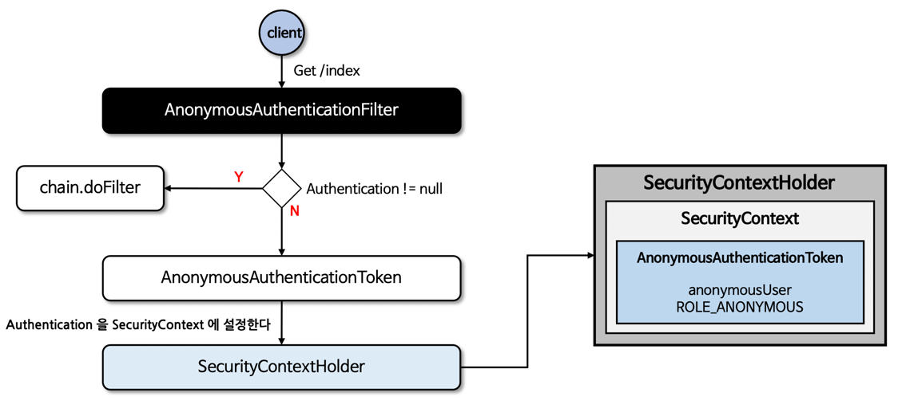

```java
public class AnonymousAuthenticationFilter extends GenericFilterBean implements InitializingBean {

  @Override
  public void doFilter(ServletRequest req, ServletResponse res, FilterChain chain)
      throws IOException, ServletException {
    Supplier<SecurityContext> deferredContext = this.securityContextHolderStrategy.getDeferredContext();
    this.securityContextHolderStrategy
        .setDeferredContext(
            defaultWithAnonymous((HttpServletRequest) req,
                deferredContext)); //anonymous Authentication 생성
    chain.doFilter(req, res);
  }
}
```

◼︎ 로그아웃

- DefaultLogoutPageGeneratingFilter를 통해 로그아웃 페이지를 제공 "GET / logout" URL 로 접근 가능
- 로그아웃 실행은 "POST / logout" 으로 가능하나 CSRF 기능을 비활성화 시키거나 RequestMater를 사용할 경우 GET, PUT, DELETE 모두 가능하다.
- 로그아웃 필터를 거치지 않고 스프링 MVC에서 커스텀하게 구현할 수 있으며 로그인 페이지가 커스텀하게 생성될 경우 로그아웃 기능도 커스텀 구현 해야 한다.

.png)

◼ LogoutFilter

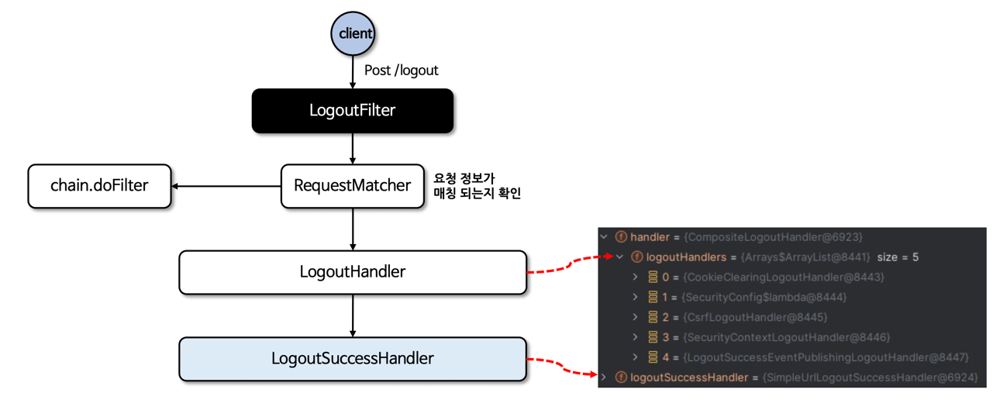

```java
public class LogoutFilter extends GenericFilterBean {

  private void doFilter(HttpServletRequest request, HttpServletResponse response, FilterChain chain)
      throws IOException, ServletException {
    if (requiresLogout(request, response)) {  //로그아웃 요청 check
      Authentication auth = this.securityContextHolderStrategy.getContext().getAuthentication();
      if (this.logger.isDebugEnabled()) {
        this.logger.debug(LogMessage.format("Logging out [%s]", auth));
      }
      this.handler.logout(request, response, auth);
      this.logoutSuccessHandler.onLogoutSuccess(request, response, auth);
      return;
    }
    chain.doFilter(request, response);
  }
}
```

◼︎ RequestCache

- 인증 절차 문제로 리다이렉트 된 후에 이전에 했던 요청 정보를 담고 있는 'SavedRequest' 객체를 쿠키 혹은 세션에 저장하고 필요시 다시 가져와 실행하는 캐시 메커니즘

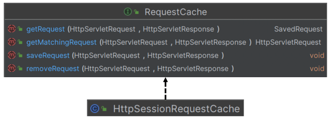

◼ SavedRequest

- 로그인과 같은 인증 절차 후 사용자를 인증 이전의 원래 페이지로 안내하며 이전 요청과 관련된 여러 정보를 저장
  ︎
  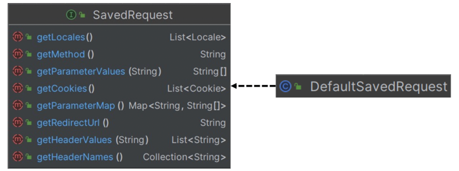

◼ AuthenticationSuccessHandler

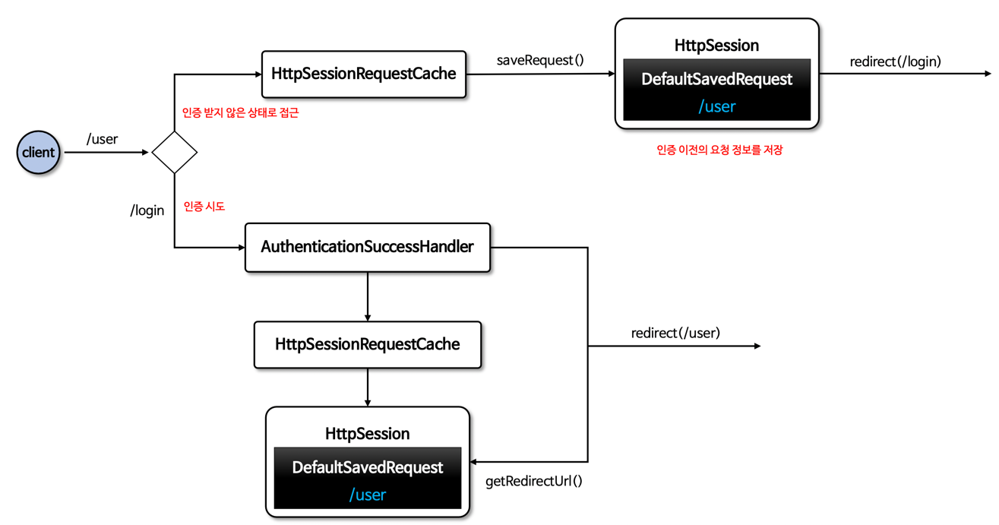

◼︎ requestCache() API

- 요청 url에 customParam=y 라는 이름의 매개 변수가 있는 경우에만 HttpSession에 저장된 SavedRequest 처리 하도록 설정할 수 있다.
  (기본값은 "continue")

```java
HttpSessionRequestCache requestCache=new HttpSessionRequestCache();
    requestCache.setMatchingRequestParameterName("customParam=y");
    http
    .requestCache((cache)->cache.requestCache(requestCache)
    );
```

- 요청을 저장하지 않도록 하려면 NullRequestCache 구현을 사용할 수 있다.

```java
RequestCache nullRequestCache=new NullRequestCache();
    http
    .requestCache((cache)->cache.requestCache(nullRequestCache)
    );
```

◼︎ RequestCacheAwareFilter

- 이전에 저장했던 웹 요청을 다시 불러오는 역할을 한다.
- SavedRequest가 현재 Request와 일치하면 이 요청을 필터 체인의 doFilter 메서드로 전달하고 SavedRequest가 없으면 원래 Request를 그대로
  진행시킨다.

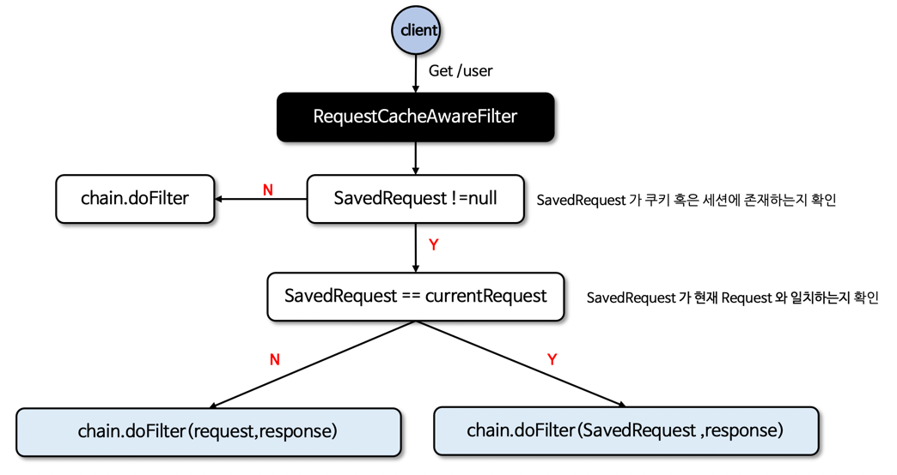

```java
public class ExceptionTranslationFilter extends GenericFilterBean implements MessageSourceAware {

  protected void sendStartAuthentication(HttpServletRequest request, HttpServletResponse response,
      FilterChain chain,
      AuthenticationException reason) throws ServletException, IOException {
    // SEC-112: Clear the SecurityContextHolder's Authentication, as the
    // existing Authentication is no longer considered valid
    SecurityContext context = this.securityContextHolderStrategy.createEmptyContext();
    this.securityContextHolderStrategy.setContext(context);
    this.requestCache.saveRequest(request, response);                 //이전 오류요청 save Cache
    this.authenticationEntryPoint.commence(request, response, reason);
  }
}

public class HttpSessionRequestCache implements RequestCache {

  @Override
  public void saveRequest(HttpServletRequest request, HttpServletResponse response) {
    if (!this.requestMatcher.matches(request)) {
      if (this.logger.isTraceEnabled()) {
        this.logger
            .trace(LogMessage.format("Did not save request since it did not match [%s]",
                this.requestMatcher));
      }
      return;
    }

    if (this.createSessionAllowed || request.getSession(false) != null) {
      // Store the HTTP request itself. Used by
      // AbstractAuthenticationProcessingFilter
      // for redirection after successful authentication (SEC-29)
      DefaultSavedRequest savedRequest = new DefaultSavedRequest(request, this.portResolver,
          this.matchingRequestParameterName);                                         // DefaultSavedRequest 생성
      request.getSession().setAttribute(this.sessionAttrName, savedRequest);          // 세션 save
      if (this.logger.isDebugEnabled()) {
        this.logger.debug(
            LogMessage.format("Saved request %s to session", savedRequest.getRedirectUrl()));
      }
    } else {
      this.logger.trace(
          "Did not save request since there's no session and createSessionAllowed is false");
    }
  }
}

/**
 * 로그인 인증 성공 후 필터
 * (UsernamePasswordAuthenticationFilter) AbstractAuthenticationProcessingFilter.successfulAuthentication 메서드
 *
 */
public class SavedRequestAwareAuthenticationSuccessHandler extends
    SimpleUrlAuthenticationSuccessHandler {

  @Override
  public void onAuthenticationSuccess(HttpServletRequest request, HttpServletResponse response,
      Authentication authentication) throws ServletException, IOException {
    SavedRequest savedRequest = this.requestCache.getRequest(request,
        response);    // 이전 SavedRequest 세션에서 가져오기
    if (savedRequest == null) {
      super.onAuthenticationSuccess(request, response, authentication);
      return;
    }
    String targetUrlParameter = getTargetUrlParameter();
    if (isAlwaysUseDefaultTargetUrl()
        || (targetUrlParameter != null && StringUtils.hasText(
        request.getParameter(targetUrlParameter)))) {
      this.requestCache.removeRequest(request, response);
      super.onAuthenticationSuccess(request, response, authentication);
      return;
    }
    clearAuthenticationAttributes(request);
    // Use the DefaultSavedRequest URL
    String targetUrl = savedRequest.getRedirectUrl();
    getRedirectStrategy().sendRedirect(request, response, targetUrl);
  }
}

/**
 * request 바꿔치기
 */
public class RequestCacheAwareFilter extends GenericFilterBean {

  @Override
  public void doFilter(ServletRequest request, ServletResponse response, FilterChain chain)
      throws IOException, ServletException {
    HttpServletRequest wrappedSavedRequest = this.requestCache.getMatchingRequest(
        (HttpServletRequest) request,
        (HttpServletResponse) response);
    chain.doFilter((wrappedSavedRequest != null) ? wrappedSavedRequest : request, response);
  }
}
```