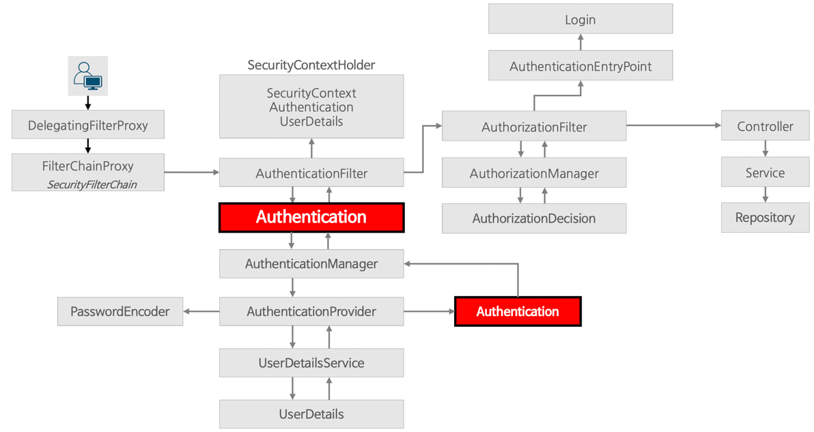
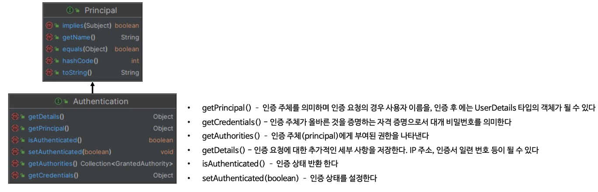
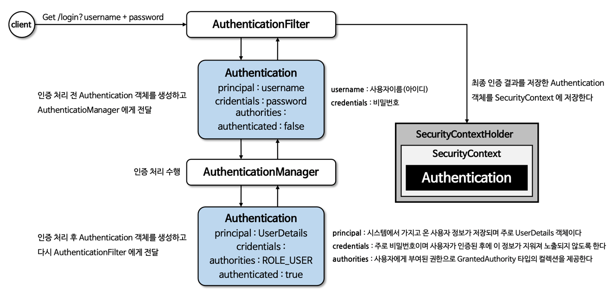
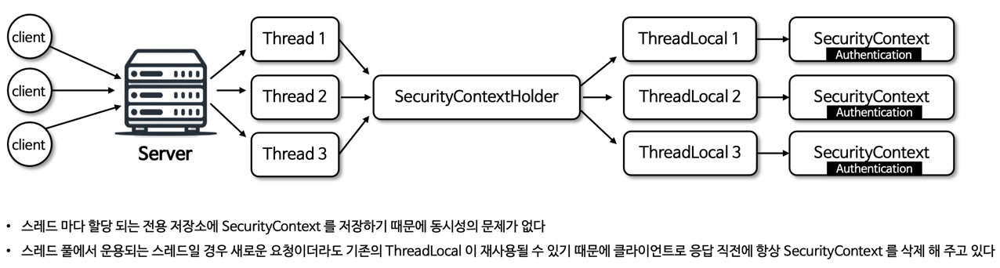
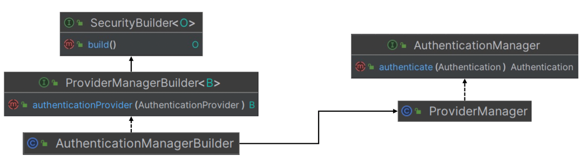
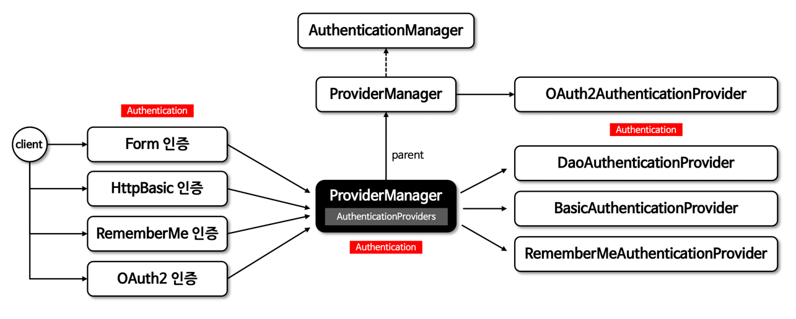

# 인증 아키텍쳐

◼ 시큐리티 인증 / 인가 흐름도

︎

◼︎ Authentication

- 인증은 특정 자원에 접근하려는 사람의 신원을 확인하는 방법을 의미
- 사용자 인증의 일반적인 방법은 사용자 이름과 비밀번호를 입력하게 하는 것으로서 인증이 되면 권한 부여할 수 있다.
- Authentication은 사용자의 인증 정보를 저장하는 토큰 개념의 객체로 활용되며 인증 이후 SecurityContext에 저장되어 전역적으로 참조 가능하다.



◼︎ 인증 절차 흐름



```java
/**
 * UsernamePasswordAuthenticationFilter 부모 클래스
 * 인증 프로세스 전체적인 로직을 담당
 */
public abstract class AbstractAuthenticationProcessingFilter extends GenericFilterBean
    implements ApplicationEventPublisherAware, MessageSourceAware {

  private void doFilter(HttpServletRequest request, HttpServletResponse response, FilterChain chain)
      throws IOException, ServletException {
    if (!requiresAuthentication(request, response)) {
      chain.doFilter(request, response);
      return;
    }
    try {
      Authentication authenticationResult = attemptAuthentication(request, response);
      if (authenticationResult == null) {
        // return immediately as subclass has indicated that it hasn't completed
        return;
      }
      this.sessionStrategy.onAuthentication(authenticationResult, request, response);
      // Authentication success
      if (this.continueChainBeforeSuccessfulAuthentication) {
        chain.doFilter(request, response);
      }
      successfulAuthentication(request, response, chain, authenticationResult);
    } catch (InternalAuthenticationServiceException failed) {
      this.logger.error("An internal error occurred while trying to authenticate the user.",
          failed);
      unsuccessfulAuthentication(request, response, failed);
    } catch (AuthenticationException ex) {
      // Authentication failed
      unsuccessfulAuthentication(request, response, ex);
    }
  }
}

/**
 * UsernamePasswordAuthenticationFilter : Security Form Default Login Filter
 * 폼 인증 처리 default 비즈니스 로직을 담당
 * 미인증 상태의 Authentication을 생성 후 AuthenticationManager에게 위임
 */
public class UsernamePasswordAuthenticationFilter extends AbstractAuthenticationProcessingFilter {

  @Override
  public Authentication attemptAuthentication(HttpServletRequest request,
      HttpServletResponse response)
      throws AuthenticationException {
    if (this.postOnly && !request.getMethod().equals("POST")) {
      throw new AuthenticationServiceException(
          "Authentication method not supported: " + request.getMethod());
    }
    String username = obtainUsername(request);
    username = (username != null) ? username.trim() : "";
    String password = obtainPassword(request);
    password = (password != null) ? password : "";
    UsernamePasswordAuthenticationToken authRequest = UsernamePasswordAuthenticationToken.unauthenticated(
        username,
        password);
    // Allow subclasses to set the "details" property
    setDetails(request, authRequest);
    return this.getAuthenticationManager().authenticate(authRequest);
  }
}

/**
 * AuthenticationManager 구현 서브 클래스
 * UsernamePasswordAuthenticationFilter으로 부터 위임 받은 미인증 Authentication을 provider에게 인증 위임
 */
public class ProviderManager implements AuthenticationManager, MessageSourceAware,
    InitializingBean {

  @Override
  public Authentication authenticate(Authentication authentication) throws AuthenticationException {
    Class<? extends Authentication> toTest = authentication.getClass();
    AuthenticationException lastException = null;
    AuthenticationException parentException = null;
    Authentication result = null;
    Authentication parentResult = null;
    int currentPosition = 0;
    int size = this.providers.size();
    for (AuthenticationProvider provider : getProviders()) {
      if (!provider.supports(toTest)) {
        continue;
      }
      if (logger.isTraceEnabled()) {
        logger.trace(LogMessage.format("Authenticating request with %s (%d/%d)",
            provider.getClass().getSimpleName(), ++currentPosition, size));
      }
      try {
        result = provider.authenticate(authentication);
        if (result != null) {
          copyDetails(authentication, result);
          break;
        }
      } catch (AccountStatusException | InternalAuthenticationServiceException ex) {
        prepareException(ex, authentication);
        // SEC-546: Avoid polling additional providers if auth failure is due to
        // invalid account status
        throw ex;
      } catch (AuthenticationException ex) {
        lastException = ex;
      }
    }
    if (result == null && this.parent != null) {
      // Allow the parent to try.
      try {
        parentResult = this.parent.authenticate(authentication);
        result = parentResult;
      } catch (ProviderNotFoundException ex) {
        // ignore as we will throw below if no other exception occurred prior to
        // calling parent and the parent
        // may throw ProviderNotFound even though a provider in the child already
        // handled the request
      } catch (AuthenticationException ex) {
        parentException = ex;
        lastException = ex;
      }
    }
    if (result != null) {
      if (this.eraseCredentialsAfterAuthentication && (result instanceof CredentialsContainer)) {
        // Authentication is complete. Remove credentials and other secret data
        // from authentication
        ((CredentialsContainer) result).eraseCredentials();
      }
      // If the parent AuthenticationManager was attempted and successful then it
      // will publish an AuthenticationSuccessEvent
      // This check prevents a duplicate AuthenticationSuccessEvent if the parent
      // AuthenticationManager already published it
      if (parentResult == null) {
        this.eventPublisher.publishAuthenticationSuccess(result);
      }

      return result;
    }

    // Parent was null, or didn't authenticate (or throw an exception).
    if (lastException == null) {
      lastException = new ProviderNotFoundException(
          this.messages.getMessage("ProviderManager.providerNotFound",
              new Object[]{toTest.getName()}, "No AuthenticationProvider found for {0}"));
    }
    // If the parent AuthenticationManager was attempted and failed then it will
    // publish an AbstractAuthenticationFailureEvent
    // This check prevents a duplicate AbstractAuthenticationFailureEvent if the
    // parent AuthenticationManager already published it
    if (parentException == null) {
      prepareException(lastException, authentication);
    }
    throw lastException;
  }
}

/**
 * ProviderManager 로 부터 위임받은 미인증 Authentication의 정보를 토대로
 * UserDetailsService에 ID/PW 인증 질의 후 인증이 완료 되면 인증 Authentication을 반환
 */
public abstract class AbstractUserDetailsAuthenticationProvider
    implements AuthenticationProvider, InitializingBean, MessageSourceAware {

  @Override
  public Authentication authenticate(Authentication authentication) throws AuthenticationException {
    Assert.isInstanceOf(UsernamePasswordAuthenticationToken.class, authentication,
        () -> this.messages.getMessage("AbstractUserDetailsAuthenticationProvider.onlySupports",
            "Only UsernamePasswordAuthenticationToken is supported"));
    String username = determineUsername(authentication);
    boolean cacheWasUsed = true;
    UserDetails user = this.userCache.getUserFromCache(username);
    if (user == null) {
      cacheWasUsed = false;
      try {
        user = retrieveUser(username, (UsernamePasswordAuthenticationToken) authentication);
      } catch (UsernameNotFoundException ex) {
        this.logger.debug("Failed to find user '" + username + "'");
        if (!this.hideUserNotFoundExceptions) {
          throw ex;
        }
        throw new BadCredentialsException(this.messages
            .getMessage("AbstractUserDetailsAuthenticationProvider.badCredentials",
                "Bad credentials"));
      }
      Assert.notNull(user, "retrieveUser returned null - a violation of the interface contract");
    }
    try {
      this.preAuthenticationChecks.check(user);
      additionalAuthenticationChecks(user, (UsernamePasswordAuthenticationToken) authentication);
    } catch (AuthenticationException ex) {
      if (!cacheWasUsed) {
        throw ex;
      }
      // There was a problem, so try again after checking
      // we're using latest data (i.e. not from the cache)
      cacheWasUsed = false;
      user = retrieveUser(username, (UsernamePasswordAuthenticationToken) authentication);
      this.preAuthenticationChecks.check(user);
      additionalAuthenticationChecks(user, (UsernamePasswordAuthenticationToken) authentication);
    }
    this.postAuthenticationChecks.check(user);
    if (!cacheWasUsed) {
      this.userCache.putUserInCache(user);
    }
    Object principalToReturn = user;
    if (this.forcePrincipalAsString) {
      principalToReturn = user.getUsername();
    }
    return createSuccessAuthentication(principalToReturn, authentication, user);
  }
}
```

◼︎ SecurityContext

- Authentication 저장 : 현재 인증된 사용자의 Authentication 객체를 저장
- ThreadLocal 저장소 사용 : SecurityContextHolder를 통해 접근되며 ThreadLocal 저장소를 사용해 각 스레드가 자신만의 컨텍스트를 유지
- 애플리케이션의 어느 곳에서나 현재 사용자의 인증 상태나 권한을 확인할 수 있다.

◼︎ SecurityContextHolder 저장모드

- MODE_THREADLOCAL : default 모드, 각 스레드가 독립적인 보안 컨텍스트를 가진다.
- MODE_INHERITABLETHREADLOCAL : 부모 스레드로부터 자식 스레드로 보안 컨텍스트가 상속, 스레드 분산 실행 하는 경우 유용
- MODE_GLOBAL : 전역적으로 단일 보안 컨텍스트를 사용, 서버 환경에서 부적합

◼︎ SecurityContext 참조 및 삭제

- SecurityContext 참조 : SecurityContextHolder.getContextHolderStrategy().getContext()
- SecurityContext 삭제 : SecurityContextHolder.getContextHolderStrategy().clearContext()

◼︎ SecurityContextHolder / SecurityContext 구조



◼ SecurityContextHolderStrategy 사용하기

- 기존방식

```
SecurityContext context = SecurityContextHolder.createEmptyContext();
context.setAuthentication(authentication);
SecurityContextHolder.setContext(context);
```

여러 어플리케이션 컨텍스트가 SecurityContextHolderStrategy를 지정하려고 할 때 동시성 이슈가 발생한다.

- 변경 방식

```
SecurityContextHolderStrategy securityContextHolderStrategy = SecurityContextHolder.getContextHolderStrategy();
SecurityContext context = securityContextHolderStrategy.createEmptyContext();
context.setAuthentication(authentication);
securityContextHolderStrategy.setContext(context);
```

SecurityContext에 정적으로 접근하는건 기존과 동일하지만 SecurityContextHolderStrategy 를 각 어플리케이션에서 자동주입 되도록 해서 동시성 이슈를
해결

```java
/**
 * 인증이 정상적으로 수행되었다면 successfulAuthentication 매소드 수행
 *
 * - SecurityContextHolderStrategy > ThreadLocal 에 SecurityContext 저장
 * - HttpSession에 SecurityContext 저장
 */
public abstract class AbstractAuthenticationProcessingFilter extends GenericFilterBean
    implements ApplicationEventPublisherAware, MessageSourceAware {

  protected void successfulAuthentication(HttpServletRequest request, HttpServletResponse response,
      FilterChain chain,
      Authentication authResult) throws IOException, ServletException {
    SecurityContext context = this.securityContextHolderStrategy.createEmptyContext();
    context.setAuthentication(authResult);
    this.securityContextHolderStrategy.setContext(context);
    this.securityContextRepository.saveContext(context, request, response);
    if (this.logger.isDebugEnabled()) {
      this.logger.debug(LogMessage.format("Set SecurityContextHolder to %s", authResult));
    }
    this.rememberMeServices.loginSuccess(request, response, authResult);
    if (this.eventPublisher != null) {
      this.eventPublisher.publishEvent(
          new InteractiveAuthenticationSuccessEvent(authResult, this.getClass()));
    }
    this.successHandler.onAuthenticationSuccess(request, response, authResult);
  }
}
```

◼︎ AuthenticationManager

- 인증 필터로부터 Authentication 객체를 전달받아 인증을 시도하며 인증에 성공할 경우 인증된 Authentication 객체를 반환
- AuthenticationManager는 여러 AuthenticationProvider를 관리하며 AuthenticationProvider 목록을 순차적으로 순회하며 인증
  요청한다.
- AuthenticationProvider 목록 중에서 인증 처리 요건에 맞는 적절한 AuthenticationProvider 를 찾아 인증 한다.
- AuthenticationMangerBuilder에 의해 생성되며 주로 사용되는 구현체로 ProviderManager가 제공

◼︎ AuthenticationManagerBuilder

- AuthenticationManager 객체를 생성하며 UserDetailsService 및 AuthenticationProvider를 추가할 수 있다.
- HttpSecurity.getSharedObject(AuthenticationManagerBuilder.class)를 통해 참조할 수 있다.



◼︎ AuthenticationManager 흐름도

- 선택적으로 부모 AuthenticationManager 를 구성할 수 있으며 이 부모는 AuthenticationProvider가 인증을 수행할 수 없는 경우 추가 탐색할 수
  있다.
- AuthenticationProvider 로부터 null이 아닌 응답을 받을 때까지 순차 시도하며 응답을 받지 못하면 ProviderNotFoundException이 발생한다.



```java
/**
 * Application 기동 시 HttpSecurity bean 생성 시점
 * - AuthenticationManagerBuilder 생성
 *   > parentAuthenticationManager 세팅 (default ProviderManager.providers[DaoAuthenticationProvider]
 */
@Configuration(proxyBeanMethods = false)
class HttpSecurityConfiguration {

  @Bean(HTTPSECURITY_BEAN_NAME)
  @Scope("prototype")
  HttpSecurity httpSecurity() throws Exception {
    LazyPasswordEncoder passwordEncoder = new LazyPasswordEncoder(this.context);
    AuthenticationManagerBuilder authenticationBuilder = new DefaultPasswordEncoderAuthenticationManagerBuilder(
        this.objectPostProcessor, passwordEncoder);
    authenticationBuilder.parentAuthenticationManager(
        authenticationManager()); // AuthenticationConfiguration.
    authenticationBuilder.authenticationEventPublisher(getAuthenticationEventPublisher());
    HttpSecurity http = new HttpSecurity(this.objectPostProcessor, authenticationBuilder,
        createSharedObjects());
    WebAsyncManagerIntegrationFilter webAsyncManagerIntegrationFilter = new WebAsyncManagerIntegrationFilter();
    webAsyncManagerIntegrationFilter.setSecurityContextHolderStrategy(
        this.securityContextHolderStrategy);
    // @formatter:off
    http
            .csrf(withDefaults())
            .addFilter(webAsyncManagerIntegrationFilter)
            .exceptionHandling(withDefaults())
            .headers(withDefaults())
            .sessionManagement(withDefaults())
            .securityContext(withDefaults())
            .requestCache(withDefaults())
            .anonymous(withDefaults())
            .servletApi(withDefaults())
            .apply(new DefaultLoginPageConfigurer<>());
    http.logout(withDefaults());
    // @formatter:on
    applyCorsIfAvailable(http);
    applyDefaultConfigurers(http);
    return http;
  }
}

/**
 * 등록되 Bean을 받아서 AuthenticationManagerBuilder.build() 수행
 */
@Configuration(proxyBeanMethods = false)
@Import(ObjectPostProcessorConfiguration.class)
public class AuthenticationConfiguration {

  public AuthenticationManager getAuthenticationManager() throws Exception {
    if (this.authenticationManagerInitialized) {
      return this.authenticationManager;
    }
    AuthenticationManagerBuilder authBuilder = this.applicationContext.getBean(
        AuthenticationManagerBuilder.class);
    if (this.buildingAuthenticationManager.getAndSet(true)) {
      return new AuthenticationManagerDelegator(authBuilder);
    }
    for (GlobalAuthenticationConfigurerAdapter config : this.globalAuthConfigurers) {
      authBuilder.apply(config);
    }
    this.authenticationManager = authBuilder.build();
    if (this.authenticationManager == null) {
      this.authenticationManager = getAuthenticationManagerBean();
    }
    this.authenticationManagerInitialized = true;
    return this.authenticationManager;
  }
}

/**
 * performBuild 수행 시 default ProviderManager 세팅
 */
public class AuthenticationManagerBuilder
    extends AbstractConfiguredSecurityBuilder<AuthenticationManager, AuthenticationManagerBuilder>
    implements ProviderManagerBuilder<AuthenticationManagerBuilder> {

  @Override
  protected ProviderManager performBuild() throws Exception {
    if (!isConfigured()) {
      this.logger.debug(
          "No authenticationProviders and no parentAuthenticationManager defined. Returning null.");
      return null;
    }
    ProviderManager providerManager = new ProviderManager(this.authenticationProviders,
        this.parentAuthenticationManager);
    if (this.eraseCredentials != null) {
      providerManager.setEraseCredentialsAfterAuthentication(this.eraseCredentials);
    }
    if (this.eventPublisher != null) {
      providerManager.setAuthenticationEventPublisher(this.eventPublisher);
    }
    providerManager = postProcess(providerManager);
    return providerManager;
  }
}
```

◼︎ CustomFilter 세팅 1

- AuthenticationManager는 default로 사용

```java

@EnableWebSecurity
@Configuration
public class SecurityConfig {

  @Bean
  public SecurityFilterChain securityFilterChain(HttpSecurity http) throws Exception {
    AuthenticationManagerBuilder authenticationManagerBuilder = http.getSharedObject(
        AuthenticationManagerBuilder.class);

    AuthenticationManager authenticationManager = authenticationManagerBuilder.build();

    http
        .authorizeHttpRequests(auth -> auth
            .requestMatchers("/", "/api/login").permitAll()
            .anyRequest().authenticated())
        .authenticationManager(authenticationManager)
        .addFilterBefore(customFilter(http, authenticationManager),
            UsernamePasswordAuthenticationFilter.class);

    return http.build();
  }

  private CustomAuthenticationFilter customFilter(HttpSecurity http,
      AuthenticationManager authenticationManager) {
    CustomAuthenticationFilter customAuthenticationFilter = new CustomAuthenticationFilter(http);
    customAuthenticationFilter.setAuthenticationManager(
        authenticationManager);   //set default AuthenticationManager
    return customAuthenticationFilter;
  }
}
```

◼︎ CustomFilter 세팅 2

- AuthenticationManager 도 Custom 사용
  (ProviderManager)AuthenticationManager 내부 providers 리스트 필드도 Custom 처리

```java

@EnableWebSecurity
@Configuration
public class SecurityConfig2 {

  @Bean
  public SecurityFilterChain securityFilterChain(HttpSecurity http) throws Exception {
    http
        .authorizeHttpRequests(auth -> auth
            .requestMatchers("/", "/api/login").permitAll()
            .anyRequest().authenticated())
        .addFilterBefore(customFilter(http), UsernamePasswordAuthenticationFilter.class);
    return http.build();
  }

  public CustomAuthenticationFilter customFilter(HttpSecurity http) {

    List<AuthenticationProvider> list1 = List.of(new DaoAuthenticationProvider());
    ProviderManager parent = new ProviderManager(list1);
    List<AuthenticationProvider> list2 = List.of(new AnonymousAuthenticationProvider("key"),
        new CustomAuthenticationProvider());
    ProviderManager authenticationManager = new ProviderManager(list2, parent);

    CustomAuthenticationFilter customAuthenticationFilter = new CustomAuthenticationFilter(http);
    customAuthenticationFilter.setAuthenticationManager(authenticationManager);

    return customAuthenticationFilter;

  }
}

```

◼︎
◼︎ 