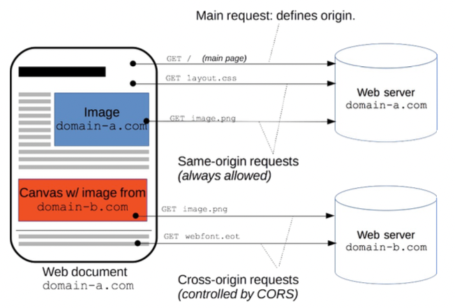
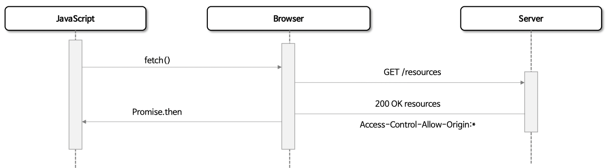
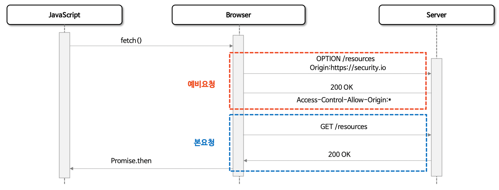
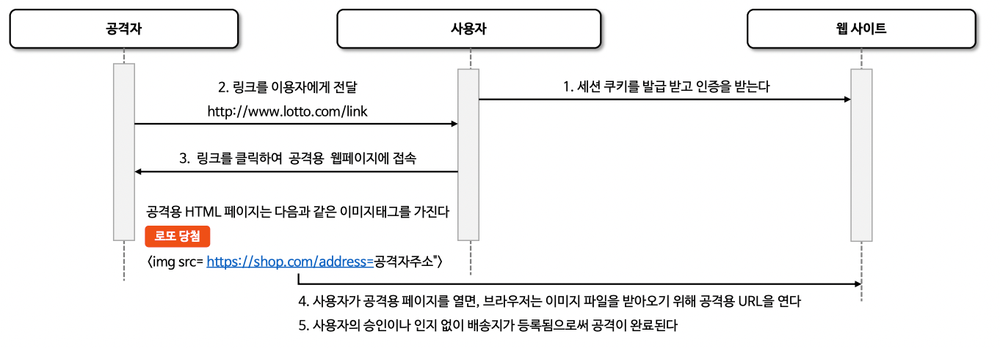

# 악용보호

## CORS (Cross Origin Resource Sharing)

- A사이트(localhost:8080) 에서 B사이트(localhost:8081) 의 데이터를 직접 호출하는 것을 제한
- 만약 이를 "허가" 하기 위해서는 B사이트(서버)에서 CORS 설정 필요



#### CORS 종류

##### 1. Simple Request

- SimpleRequest는 예비 요청(Preflight Request) 과정 없이 다이렉트로 본 요청하는 방식
- 서버가 응답 헤더에 Access-Control-Allow-Origin 값을 전송하면 브라우저가 CORS 정책 체킹

###### 제약사항

- GET, POST, HEAD 메서드만 가능
- 헤더 Key는 Accept, Accept-Language, Content-Language, Content-Type, DPR, Downlink, Save-Data,
  Viewport-Width Width 만 가능
- Content-type 은 application/x-www-form-urlencoded, multipart/form-data, text/plain 만 가능



##### 2. Preflight Request (예비요청)

- 요청을 한번에 보내지 않고, 예비 요청(OPTION METHOD)과 본 요청으로 나누어서 Request
- 브라우저가 스스로 안전한 요청인지 확인하는 것으로 요청 사항이 Simple Request에 해당하지 않을 경우 브라우저가 Preflight Request 실행



#### CORS 기준

- 프로토콜, 호스트, 포트가 동일해야 함
- 그 외에는 CORS 정책 검증 대상

#### CORS 허용 방법 - 서버에서 Access-Control-Allow-* 세팅

- Access-Control-Allow-Origin
    - 헤더에 작성된 URL만 브라우저가 리소스를 접근할 수 있도록 허용
    - https://security.io, *(전체)

- Access-Control-Allow-Methods
    - preflight request 에 대한 응답으로 실제 요청 중에 사용할 수 있는 메서드를 나타낸다
    - default) GET, POST, HEAD, OPTIONS
    - ex) PUT, *

- Access-Control-Allow-Headers
    - preflight request 에 대한 응답으로 실제 요청 중에 사용할 수 있는 헤더 필드 이름을 나타낸다
    - default) Origin,Accept,X-Requested-With,Content-Type,
      Access-Control-Request-Method,Access-Control-Request-Headers
    - ex) [Custom-Header], *

- Access-Control-Allow-Credentials
    - 실제 요청에 쿠기나 인증 등의 사용자 자격 증명이 포함될 수 있음을 나타낸다.
    - Client의 credentials:include 옵션일 경우 true 는 필수

- Access-Control-Max-Age
    - preflight 요청 결과를 캐시 할 수 있는 시간을 나타내는 것으로 해당 시간동안은 preflight 요청을 다시 하지 않게 된다

#### cors()

- CORS의 예비요청(Preflight Requsest) 에는 쿠키(JSESSIONID)가 포함되어 있지 않기 때문에 Spring Security 이전에 처리 되어야 한다.
- CORS가 먼저 처리 되도록 CorsFilter를 사용할 수 있으며 CorsConfigurationSource를 제공함으로써 Spring Security와 통합할 수 있다.

```java

@EnableWebSecurity
@Configuration
public class SecurityConfig {

  @Bean
  public SecurityFilterChain securityFilterChain(HttpSecurity http) throws Exception {

    http
        .cors(cors -> cors
            .configurationSource(corsConfigurationSource())
        )
    ;

    return http.build();
  }

  private CorsConfigurationSource corsConfigurationSource() {
    CorsConfiguration configuration = new CorsConfiguration();
    configuration.addAllowedOrigin("https://example.com");
    configuration.addAllowedMethod("GET");
    configuration.addAllowedMethod("POST");
    configuration.setAllowCredentials(true);
    UrlBasedCorsConfigurationSource source = new UrlBasedCorsConfigurationSource();
    source.registerCorsConfiguration("/**", configuration);

    return source;
  }
}
```

```java
/**
 * CorsConfigurationSource가 설정되지 않으면 Spring MVC CORS 구성 사용
 * @param <H>
 */
public class CorsConfigurer<H extends HttpSecurityBuilder<H>> extends
    AbstractHttpConfigurer<CorsConfigurer<H>, H> {

  @Override
  public void configure(H http) {
    ApplicationContext context = http.getSharedObject(ApplicationContext.class);
    CorsFilter corsFilter = getCorsFilter(context);
    Assert.state(corsFilter != null,
        () -> "Please configure either a " + CORS_FILTER_BEAN_NAME + " bean or a "
            + CORS_CONFIGURATION_SOURCE_BEAN_NAME + "bean.");
    http.addFilter(corsFilter);
  }

  private CorsFilter getCorsFilter(ApplicationContext context) {
    if (this.configurationSource != null) {
      return new CorsFilter(this.configurationSource);
    }
    boolean containsCorsFilter = context.containsBeanDefinition(CORS_FILTER_BEAN_NAME);
    if (containsCorsFilter) {
      return context.getBean(CORS_FILTER_BEAN_NAME, CorsFilter.class);
    }
    boolean containsCorsSource = context.containsBean(CORS_CONFIGURATION_SOURCE_BEAN_NAME);
    if (containsCorsSource) {
      CorsConfigurationSource configurationSource = context.getBean(
          CORS_CONFIGURATION_SOURCE_BEAN_NAME,
          CorsConfigurationSource.class);
      return new CorsFilter(configurationSource);
    }
    if (mvcPresent) {
      return MvcCorsFilter.getMvcCorsFilter(context);
    }
    return null;
  }
}
```

```java
public class CorsFilter extends GenericFilter {

  @Override
  public void doFilter(final ServletRequest servletRequest, final ServletResponse servletResponse,
      final FilterChain filterChain) throws IOException, ServletException {
    if (!(servletRequest instanceof HttpServletRequest)
        || !(servletResponse instanceof HttpServletResponse)) {
      throw new ServletException(sm.getString("corsFilter.onlyHttp"));
    }

    // Safe to downcast at this point.
    HttpServletRequest request = (HttpServletRequest) servletRequest;
    HttpServletResponse response = (HttpServletResponse) servletResponse;

    // Determines the CORS request type.
    CorsFilter.CORSRequestType requestType = checkRequestType(request);

    // Adds CORS specific attributes to request.
    if (isDecorateRequest()) {
      decorateCORSProperties(request, requestType);
    }
    switch (requestType) {
      case SIMPLE:
        // Handles a Simple CORS request.
      case ACTUAL:
        // Handles an Actual CORS request.
        this.handleSimpleCORS(request, response, filterChain);
        break;
      case PRE_FLIGHT:
        // Handles a Pre-flight CORS request.
        this.handlePreflightCORS(request, response, filterChain);
        break;
      case NOT_CORS:
        // Handles a Normal request that is not a cross-origin request.
        this.handleNonCORS(request, response, filterChain);
        break;
      default:
        // Handles a CORS request that violates specification.
        this.handleInvalidCORS(request, response, filterChain);
        break;
    }
  }
}
```

## CSRF (Cross Site Request Forgery)

- 웹 어플리케이션의 보안 취약점으로 공격자가 사용자의 이미 인증된 다른 사이트에 대해 원치 않는 작업을 수행하게 만드는 기법
- 이 공격은 쿠키나 인증 세션을 이용하여 사용자가 의도하지 않는 요청을 서버로 전송하게 만든다.
- 이는 사용자가 로그인한 상태에서 악의적인 웹사이트를 방문하거나 이메일 등을 통해 악의적인 링크를 클릭할 때 발생할 수 있다.

#### CSRF 진행순서



#### csrf()

- csrf 토큰은 서버에 의해 생성되어 세션에 저장되고 모든 변경 요청(POST, PUT, DELETE)에 csrf 토큰 검증을 수행한다.
- 쿠키가 아닌 HTTP 헤더나 요청 파라미터에 위치해야 CSRF 공격을 방지 할 수 있음.

```java

@EnableWebSecurity
@Configuration
public class SecurityConfig {

  @Bean
  public SecurityFilterChain securityFilterChain(HttpSecurity http) throws Exception {

    http.authorizeHttpRequests(auth -> auth
            .anyRequest().authenticated())
        .formLogin(Customizer.withDefaults())
        .csrf(Customizer.withDefaults())  // default 사용상태
        .csrf(csrf -> csrf.disable())     // 비활성화
        .csrf(csrf -> csrf.ignoringRequestMatchers("/api/*")) //  특정 경로 비활성화
    ;

    return http.build();
  }
}
```

#### CSRF 토큰 유지 - CsrfTokenRepository

- CsrfToken은 CsrfTokenRepository를 사용하여 영속화

##### HttpSessionCsrfTokenRepository && CookieCsrfTokenRepository

- default 로 HttpSessionCsrfTokenRepository 가 사용된다.
- HttpSessionCsrfTokenRepository 는 HTTP 요청 헤더인 "X-CSRF-TOKEN" 또는 "_csrf" 요청 파라미터에서 토큰을 읽는다.
- CookieCsrfTokenRepository 는 "XSRF-TOKEN" 을 key로 쿠키를 작성하고 HTTP 요청 헤더인 "X-XSRF-TOKEN" 또는 요청 매개변수인 "_
  csrf"에서 읽는다

```java

@EnableWebSecurity
@Configuration
public class SecurityConfig {

  @Bean
  public SecurityFilterChain securityFilterChain(HttpSecurity http) throws Exception {

    http.authorizeHttpRequests(auth -> auth
            .anyRequest().authenticated())
        .formLogin(Customizer.withDefaults())
        .csrf(csrf -> csrf
            .csrfTokenRepository(new HttpSessionCsrfTokenRepository())  // 세션에 토큰 저장
            .csrfTokenRepository(new CookieCsrfTokenRepository())       // 쿠키에 토큰 저장
        )
    ;

    return http.build();
  }
}
```

#### CSRF 토큰 처리 - CsrfTokenRequestHandler

- CsrfToken 은 CsrfTokenRequestHandler를 사용하여 토큰을 생성하고 HTTP 헤더 또는 요청 파라미터로부터 토큰 유효성 검증을 수행한다.
- XorCsrfTokenRequestAttributeHandler 와 CsrfTokenRequestAttributeHandler 를 제공하며 커스텀 핸들러를 구현할 수 있다.
- CsrfToken 은 지연로딩 전략을 사용한다.

```java

@EnableWebSecurity
@Configuration
public class SecurityConfig {

  @Bean
  public SecurityFilterChain securityFilterChain(HttpSecurity http) throws Exception {

    http.authorizeHttpRequests(auth -> auth
            .anyRequest().authenticated())
        .formLogin(Customizer.withDefaults())
        .csrf(csrf -> csrf
            .csrfTokenRequestHandler(new XorCsrfTokenRequestAttributeHandler())
        )
    ;

    return http.build();
  }
}
```

```java
public final class CsrfFilter extends OncePerRequestFilter {

  @Override
  protected void doFilterInternal(HttpServletRequest request, HttpServletResponse response,
      FilterChain filterChain)
      throws ServletException, IOException {
    DeferredCsrfToken deferredCsrfToken = this.tokenRepository.loadDeferredToken(request, response);
    request.setAttribute(DeferredCsrfToken.class.getName(), deferredCsrfToken);
    this.requestHandler.handle(request, response, deferredCsrfToken::get);
    if (!this.requireCsrfProtectionMatcher.matches(request)) {
      if (this.logger.isTraceEnabled()) {
        this.logger.trace("Did not protect against CSRF since request did not match "
            + this.requireCsrfProtectionMatcher);
      }
      filterChain.doFilter(request, response);
      return;
    }
    CsrfToken csrfToken = deferredCsrfToken.get();    // 지연로딩
    String actualToken = this.requestHandler.resolveCsrfTokenValue(request, csrfToken);
    if (!equalsConstantTime(csrfToken.getToken(), actualToken)) {
      boolean missingToken = deferredCsrfToken.isGenerated();
      this.logger
          .debug(LogMessage.of(
              () -> "Invalid CSRF token found for " + UrlUtils.buildFullRequestUrl(request)));
      AccessDeniedException exception =
          (!missingToken) ? new InvalidCsrfTokenException(csrfToken, actualToken)
              : new MissingCsrfTokenException(actualToken);
      this.accessDeniedHandler.handle(request, response, exception);
      return;
    }
    filterChain.doFilter(request, response);
  }
}

public interface DeferredCsrfToken {

  CsrfToken get();

  boolean isGenerated();

}

```