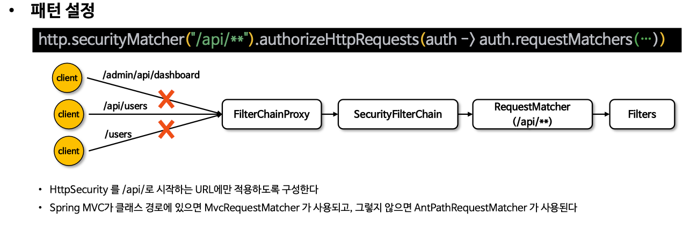
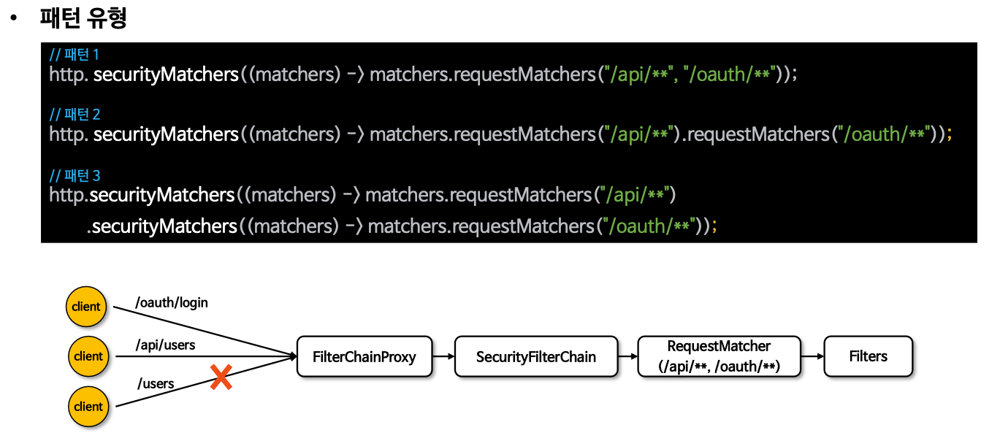
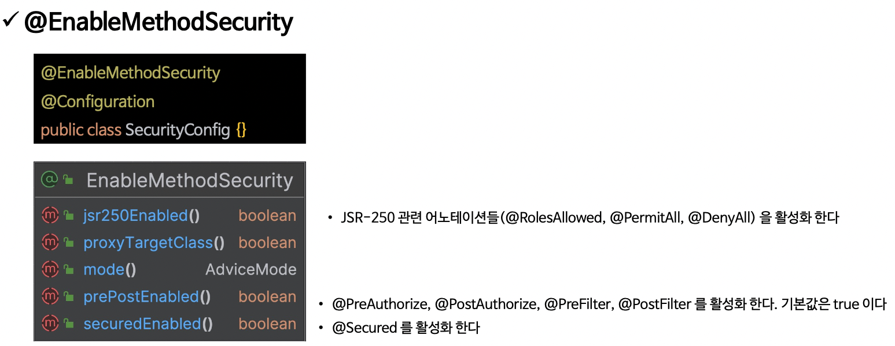

# 인가 프로세스

- Spring Security 는 요청 기반 권한 부여(Request Based Authorization)와 메서드 기반 권한 부여(Method Based
  Authorization) 를 통해 자원 관리를 제공한다.
- 요청 기반 권한 부여는 클라이언트의 요청에 대한 권한 부여를 모델링 한다.

### HttpSecurity.authorizeHttpRequests()

- authorizeHttpRequests() 을 통해 요청과 권한 규칙이 설정되면 내부적으로 AuthorizationFilter 가 요청에 대한 권한 검사 및 승인 작업을 수행

```java

@EnableWebSecurity
@Configuration
public class SecurityConfig {

  @Bean
  public SecurityFilterChain securityFilterChain(HttpSecurity http,
      HandlerMappingIntrospector introspector) throws Exception {

    http
        .authorizeHttpRequests(authorize -> authorize
            .requestMatchers("/", "/login").permitAll()
            .requestMatchers("/user")
            .hasAuthority("ROLE_USER") // "/user" 엔드포인트에 대해 "USER" 권한을 요구합니다.
            .requestMatchers("/myPage/**")
            .hasRole("USER") // "/mypage" 및 하위 디렉터리에 대해 "USER" 권한을 요구합니다. Ant 패턴 사용.
            .requestMatchers(HttpMethod.POST)
            .hasAuthority("ROLE_WRITE") // POST 메소드를 사용하는 모든 요청에 대해 "write" 권한을 요구합니다.
            .requestMatchers(new AntPathRequestMatcher("/manager/**")).hasAuthority(
                "ROLE_MANAGER") // "/manager" 및 하위 디렉터리에 대해 "MANAGER" 권한을 요구합니다. AntPathRequestMatcher 사용.
            .requestMatchers(new MvcRequestMatcher(introspector, "/admin/payment")).hasAuthority(
                "ROLE_ADMIN") // "/manager" 및 하위 디렉터리에 대해 "MANAGER" 권한을 요구합니다. AntPathRequestMatcher 사용.
            .requestMatchers("/admin/**").hasAnyAuthority("ROLE_ADMIN",
                "ROLE_MANAGER") // "/admin" 및 하위 디렉터리에 대해 "ADMIN" 또는 "MANAGER" 권한 중 하나를 요구합니다.
            .requestMatchers(new RegexRequestMatcher("/resource/[A-Za-z0-9]+", null)).hasAuthority(
                "ROLE_MANAGER") // 정규 표현식을 사용하여 "/resource/[A-Za-z0-9]+" 패턴에 "MANAGER" 권한을 요구합니다.
            .anyRequest().authenticated())// 위에서 정의한 규칙 외의 모든 요청은 인증을 필요로 합니다.
        .formLogin(Customizer.withDefaults())
        .csrf(AbstractHttpConfigurer::disable);

    return http.build();
  }
}
```

##### 주의사항

- 위에서부터 아래로 나열된 순서대로 처리하며 첫번쨰 일치만 적용되고 다음 순서로 넘어가지 않는다.
- "/admin/**" 가 "/admin/db" 요청을 포함하므로 좁은 범위의 경로("/admin/db")를 먼저 정의해야 한다.

### 표현식 및 커스텀 권한 구현

- 표현식을 사용해서 권한 규칙을 설정 하도록 WebExpressionAuthorizationManager 를 제공
- 표현식은 시큐리티가 제공하는 권한 규칙을 사용하거나 사용자가 커스텀하게 구현할 수 있다.

1. 시큐리티 제공 권한 규칙

```
  @Bean
  public SecurityFilterChain securityFilterChain(HttpSecurity http, ApplicationContext context) throws Exception {

      http.authorizeHttpRequests(authorize -> authorize
              .requestMatchers("/user/{name}")
              .access(new WebExpressionAuthorizationManager("#name == authentication.name"))    // 로그인 계정 name 과 요청 url의 name이 일치 해야 한다.

              .requestMatchers("/admin/db")
              .access(new WebExpressionAuthorizationManager("hasAuthority('ROLE_DB') or hasRole('ADMIN')"))

              .anyRequest().authenticated())
              .formLogin(Customizer.withDefaults());

      return http.build();
  }
```

2. **커스텀 권한 규칙**

```
  @Bean
  public SecurityFilterChain securityFilterChain(HttpSecurity http, ApplicationContext context) throws Exception {

      DefaultHttpSecurityExpressionHandler expressionHandler = new DefaultHttpSecurityExpressionHandler();
      expressionHandler.setApplicationContext(context);
      WebExpressionAuthorizationManager expressManager = new WebExpressionAuthorizationManager("@customWebSecurity.check(authentication, request)");  // 사용자 커스텀 권한 체크 빈 매서드를 파라미터로 넘긴다.   
      expressManager.setExpressionHandler(expressionHandler);
      http.authorizeHttpRequests(authorize -> authorize
              .requestMatchers("/custom/**").access(expressManager)
              .anyRequest().authenticated())
              .formLogin(Customizer.withDefaults());

      return http.build();
  }
```

```java

@Component("customWebSecurity")
public class CustomWebSecurity {

  public boolean check(Authentication authentication, HttpServletRequest request) {
    return authentication.isAuthenticated();
  }
}
```

3. 커스텀 Request Matcher

```
  @Bean
  public SecurityFilterChain securityFilterChain(HttpSecurity http, ApplicationContext context) throws Exception {

      http.authorizeHttpRequests(authorize -> authorize
              .requestMatchers(new CustomRequestMatcher("/admin")).hasAuthority("ROLE_ADMIN")
              .anyRequest().authenticated())
              .formLogin(Customizer.withDefaults());

      return http.build();
  }
```

```java
public class CustomRequestMatcher implements RequestMatcher {

  private final String urlPattern;

  public CustomRequestMatcher(String urlPattern) {
    this.urlPattern = urlPattern;
  }

  @Override
  public boolean matches(HttpServletRequest request) {
    String requestURI = request.getRequestURI();
    return requestURI.startsWith(urlPattern);
  }
}
```

### HttpSecurity.securityMatcher()

- securityMatcher 메서드는 특정 패턴에 해당하는 요청에만 보안 규칙을 적용하며 중복해서 정의할 경우 마지막에 설정한 것으로 대체 된다.
- 패턴설정
  


- 다중패턴설정
  

```java

@EnableWebSecurity
@Configuration
public class SecurityConfig {

  @Bean
  public SecurityFilterChain securityFilterChain(HttpSecurity http, ApplicationContext context)
      throws Exception {

    http
        .authorizeHttpRequests(authorize -> authorize
            .anyRequest().authenticated())
        .formLogin(Customizer.withDefaults());

    return http.build();
  }

  @Bean
  @Order(1)
  public SecurityFilterChain securityFilterChain2(HttpSecurity http) throws Exception {

    http
        .securityMatchers((matchers) -> matchers.requestMatchers("/api/**",
            "/oauth/**"))   // 1순위 Bean 으로 해당 경로의 request는 permitAll 
        .authorizeHttpRequests(authorize -> authorize
            .anyRequest().permitAll());

    return http.build();
  }
}
```

### 메서드 기반 권한 부여 - @PreAuthorize, @PostAuthorize

- 메서드 기반 권한 부여를 활성화 하기 위해서는 @EnableMethodSecurity 어노테이션을 추가해야 한다.
- SpEL 표현식을 사용하여 다양한 보안 조건을 정의할 수 있다.

#### @EnableMethodSecurity



##### @PreAuthorize

- 메서드가 실행되기 전에 특정한 보안 조건이 충족되는지 확인, 보통 서비스 or 컨트롤러 메서드에 적용되어 사용 된다.

##### @PostAutorize

- 메서드가 실행된 후에 보안 검사를 수행하는데 사용된다.
- 메서드 실행 후 조건에 맞는 경우에만 정상 응답 한다.

```java

@RestController
public class MethodController {

  @GetMapping("/admin")
  @PreAuthorize("hasAuthority('ROLE_ADMIN')")
  public String admin() {
    return "admin";
  }

  @GetMapping("/user")
  @PreAuthorize("hasAnyAuthority('ROLE_ADMIN', 'ROLE_USER')")
  public String user() {
    return "user";
  }

  @GetMapping("/isAuthenticated")
  @PreAuthorize("isAuthenticated()")
  public String isAuthenticated() {
    return "isAuthenticated";
  }

  @GetMapping("/user/{id}")
  @PreAuthorize("#id == authentication.name")
  public String authentication(@PathVariable(name = "id") String id) {
    return id;
  }

  @GetMapping("/owner")
  @PostAuthorize("returnObject.owner == authentication.name")
  public Account owner(String name) {
    return new Account(name, false);
  }

  @GetMapping("/isSecure")
  @PostAuthorize("hasAuthority('ROLE_ADMIN') and returnObject.isSecure")
  public Account isSecure(String name, String secure) {
    return new Account(name, "Y".equals(secure));
  }
}
```

### 메서드 기반 권한 부여 - @PreFilter, @PostFilter

##### @PreFilter

- 메서드가 실행되기 전에 메서드에 전달된 컬렉션 타입 파라미터를 필터링 한다.
- 필터링 해서 만족하는 객체들에 대해서만 파라미터에 담겨서 메서드가 수행된다.

##### @PostFilter

- 메서드 실행 후 컬렉션 타입의 결과를 필터링 한다.
- 필터링 해서 만족하는 객체들에 대해서만 메서드 응답에 담긴다.

```java

@RestController
@RequiredArgsConstructor
public class MethodController {

  private final DataService dataService;

  @GetMapping("/")
  public String index() {
    return "index";
  }

  @PostMapping("/writeList")
  public List<Account> writeList(@RequestBody List<Account> data) {

    return dataService.writeList(data);
  }

  @PostMapping("/writeMap")
  public Map<String, Account> writeMap(@RequestBody List<Account> data) {
    Map<String, Account> dataMap = data.stream()
        .collect(Collectors.toMap(Account::getOwner, account -> account));
    return dataService.writeMap(dataMap);
  }

  @GetMapping("/readList")
  public List<Account> readList() {
    return dataService.readList();
  }

  @GetMapping("/readMap")
  public Map<String, Account> readMap() {
    return dataService.readMap();
  }
}

```

### 메서드 기반 권한 부여 - @Secured, JSR-250

##### @Secured

- 지정된 권한을 가진 사용자만 해당 메서드를 호출한다.
- 더 풍부한 형식을 지원하는 @PreAuthorize 사용을 권장

##### JSR-250

- @RolesAllowed, @PermitAll, @DenyAll 어노테이션이 있다.

```java

@RestController
@RequiredArgsConstructor
public class MethodController {

  @GetMapping("/")
  public String index() {
    return "index";
  }

  @GetMapping("/user")
  @Secured("ROLE_USER")
  public String user() {
    return "user";
  }

  @GetMapping("/admin")
  @RolesAllowed("ADMIN")
  public String admin() {
    return "admin";
  }

  @GetMapping("/permitAll")
  @PermitAll
  public String permitAll() {
    return "permitAll";
  }

  @GetMapping("/denyAll")
  @DenyAll
  public String denyAll() {
    return "denyAll";
  }

  @GetMapping("/isAdmin")
  @isAdmin
  public String isAdmin() {
    return "isAdmin";
  }

  @GetMapping("/ownership")
  @OwnerShip
  public Account ownerShip(String name) {
    return new Account(name, false);
  }

  @GetMapping("/delete")
  @PreAuthorize("@myAuthorizer.isUser(#root)")
  public String delete() {
    return "delete";
  }
}
```

##### 메타 어노테이션 활용

- 편리성과 가독성을 높일 수 있는 메타 어노테이션을 활용할 수 있다.

```java

@Target({ElementType.METHOD, ElementType.TYPE})
@Retention(RetentionPolicy.RUNTIME)
@PreAuthorize("hasRole('ADMIN')")
public @interface isAdmin {

}

```

##### 커스텀 빈을 사용하여 표현식 구현

- 사용자 정의 빈을 생성하고 SpEL 표현식으로 권한 검사 메서드를 수행한다.

```java

@Component("myAuthorizer")
class MyAuthorizer {

  public boolean isUser(MethodSecurityExpressionOperations root) {
    boolean decision = root.hasAuthority("ROLE_USER");
    return decision;
  }
}

```

### 정적 자원 관리

- 정적자원(이미지, css, js 파일 등)에 대한 요청을 RequestMatcher 에 등록해서 보안 필터를 거치지 않도록 할 수 있다.

##### Ignoring 보다 permitAll 방식 권장

```
@Bean
public WebSecurityCustomizer webSecurityCustomizer() {
    return(webSecurity)-> {
      webSecurity.ignoring().requestMatchers(PathRequest.toStaticResources().atCommonLocations());
    };
}

@Bean
public SecurityFilterChain securityFilterChain(HttpSecurity http)throws Exception {
    http
    .authorizeHttpRequests(authorize->authorize
    .requestMatchers("/images/**").permitAll()
    .requestMatchers(PathRequest.toStaticResources().atCommonLocations()).permitAll()
    .anyRequest().authenticated())
    .formLogin(Customizer.withDefaults())
    .csrf(AbstractHttpConfigurer::disable);

    return http.build();
}
```

- 스프링 시큐리티 6 버전부터 세션을 확인하지 않기 때문에 성능 저하가 없다.

##### 계층적 권한 - RoleHierarchy

- 역할 간의 계층 구조를 정의한다.
- 계층적 역할을 사용하면 더 간결하고 우아한 규칙을 표헌할 수 있다.

```
@Bean
static RoleHierarchy roleHierarchy() {
    RoleHierarchyImpl hierarchy = new RoleHierarchyImpl();
    hierarchy.setHierarchy("ROLE_ADMIN > ROLE_DB\n" +
            "ROLE_DB > ROLE_USER\n" +
            "ROLE_USER > ROLE_ANONYMOUS");
    return hierarchy;
}
```

