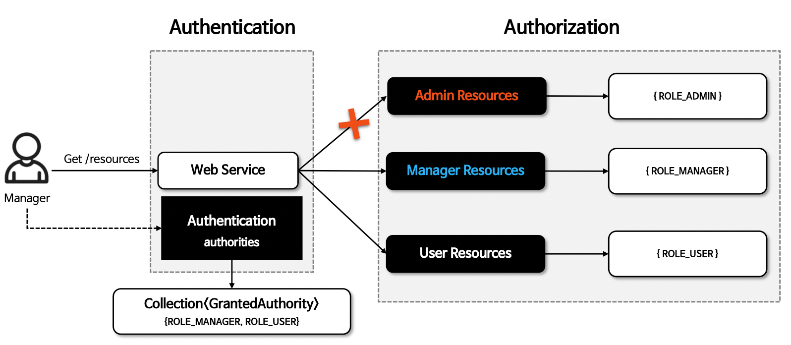
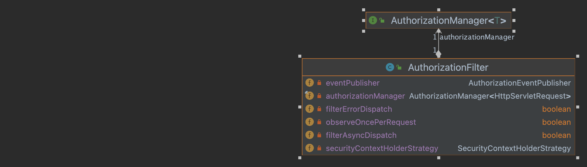
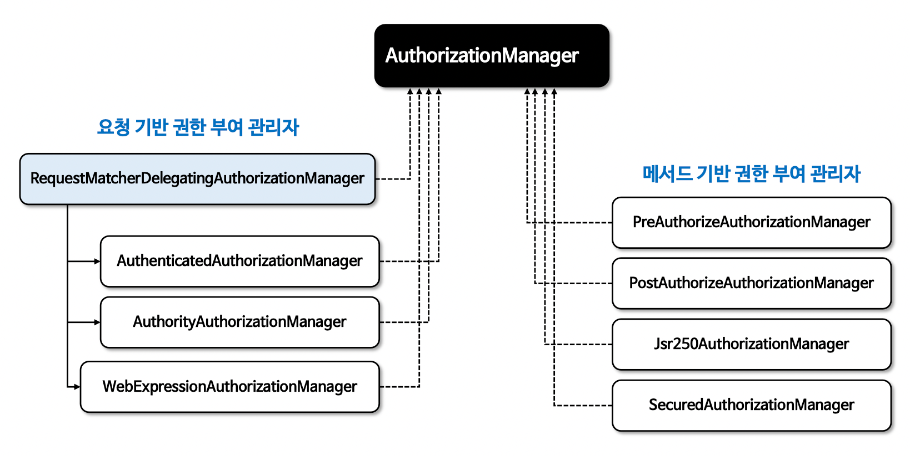
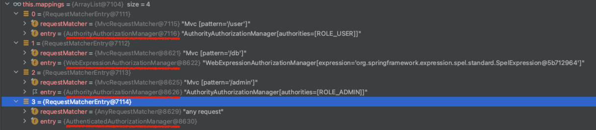
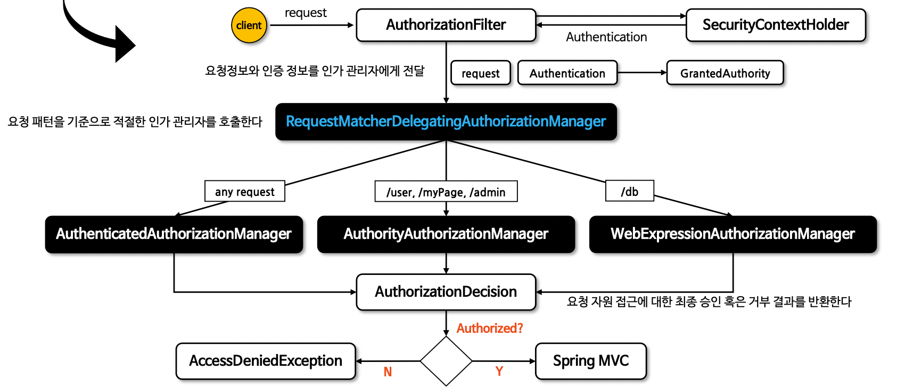
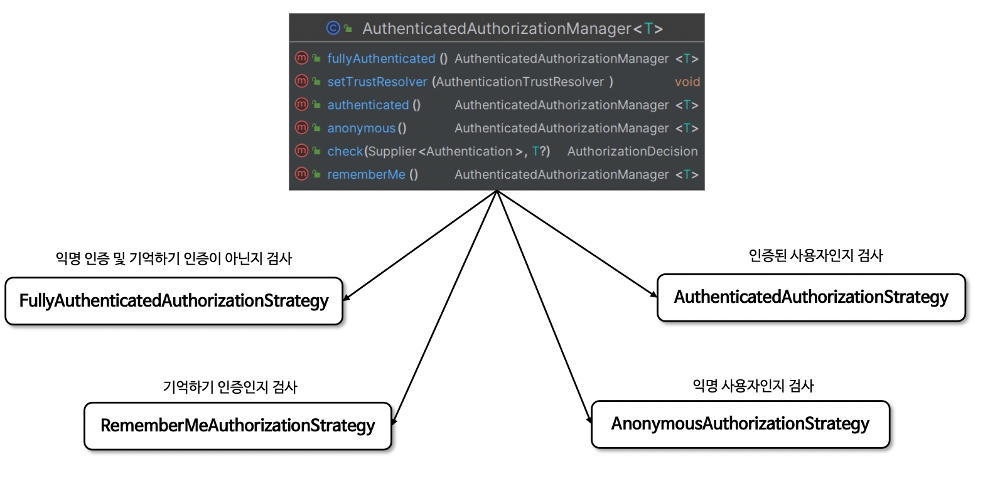
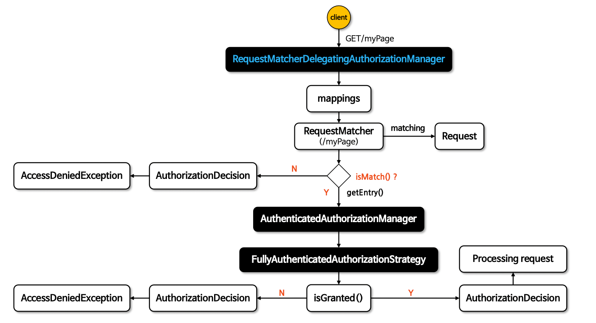
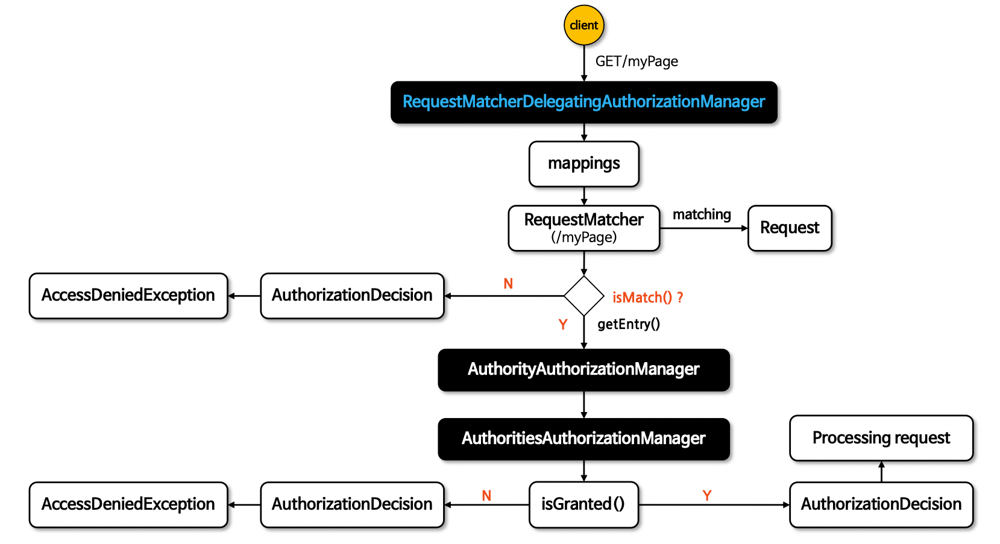

# 인가 아키텍처

## Authorization

***

- 특정 자원에 접근할 수 있는 사람을 결정하는 것을 의미
- GrantedAuthority 클래스를 통해 권한 목록을 관리하며 Authentication 이 GrantedAuthority 를 갖는다.

```java
public interface Authentication extends Principal, Serializable {

  Collection<? extends GrantedAuthority> getAuthorities();
}
```



### GrantedAuthority

***

- GrantedAuthority 는 AuthenticationManager 에 의해 Authentication 객체에 삽입되며 인가 결정을 내릴 때
  AuthenticationManager 를 사용하여 GrantedAuthority 를 체킹

#### 사용자 정의 역할 접두사

***

- default prefix 로 "ROLE_" 를 사용
- GrantedAuthorityDefaults 빈을 정의해서 사용자 커스텀 prefix 가능

## AuthorizationManager

***

- 인증된 사용자가 요청자원에 접근할 수 있는지 여부를 결정하는 인터페이스
- 요청 기반 메서드 인가, 메서드 기반 인가 에서 호출된다.
- AuthorizationFilter 를 통해 AuthorizationManager 호출이 이루어진다.



```java

@FunctionalInterface
public interface AuthorizationManager<T> {

  default void verify(Supplier<Authentication> authentication, T object) {
    AuthorizationDecision decision = check(authentication, object);
    if (decision != null && !decision.isGranted()) {
      throw new AccessDeniedException("Access Denied");
    }
  }

  @Nullable
  AuthorizationDecision check(Supplier<Authentication> authentication, T object);

}

```

### AuthorizationManager 클래스 계층 구조

***


### 요청 기반 인가 관리자

***

- 요청 기반의 인증된 사용자의 자원접근 허용 여부를 결정하는 인가 관리자 클래스
- AuthorityAuthorizationManager, AuthenticatedAuthorizationManager 와 대리자인
  RequestMatcherDelegatingAuthorizationManager 가 있다.

```
// "/user" 엔드포인트 접근(request)은 인증객체(Authentication)에서 "ROLE_USER" 권한(GrantedAuthority)을 필요로 한다.
http.authorizeHttpRequests(
  auth -> auth.requestMatchers("/user").hasRole("USER")
)
```

### HttpSecurity > requestMatchers 설정

***

```
http.authorizeHttpRequests(
  auth -> auth
    .requestMatchers("/user", "/myPage").hasAuthority("USER")
    .requestMatchers("/admin").hasRole("ADMIN")
    .requestMatchers("/db").access(new WebExpressionAuthorizationManager("hasRole('ADMIN') or hasRole('MANAGER')")) 
    .anyRequest().authenticated()
  );
)
```





### AuthenticatedAuthorizationManager 구조

***


- AuthenticatedAuthorizationManager 는 네 개의 AbstractAuthorizationStrategy 내부 구현 클래스를 통해 인증 여부 확인 전략을
  세운다

### AuthenticatedAuthorizationManager 흐름도

***


### AuthorityAuthorizationManager 구조

***

```java
public final class AuthorityAuthorizationManager<T> implements AuthorizationManager<T> {

  private static final String ROLE_PREFIX = "ROLE_";

  private final AuthoritiesAuthorizationManager delegate = new AuthoritiesAuthorizationManager();

  private final Set<String> authorities;

  @Override
  public AuthorizationDecision check(Supplier<Authentication> authentication, T object) {
    return this.delegate.check(authentication, this.authorities); // 권한여부 결정 위임
  }
}
```

- AuthorityAuthorizationManager 는 내부적으로 AuthoritesAuthorizationManager 를 사용하여 권한 여부 결정을 위임한다.

### AuthorityAuthorizationManager 흐름도

***


## 요청 기반 CustomAuthorizationManager 구현

- access(AuthorizationManager) 로 CustomAuthorizationManager 설정
- access() 에 지정한 AuthorizationManager 객체는 RequestMatcherDelegatingAuthorizationManager 의 매핑 속성에 저장

```java
public class CustomAuthorizationManager implements AuthorizationManager<RequestAuthorizationContext> {

  private static final String REQUIRED_ROLE = "ROLE_SECURE";

  @Override
  public AuthorizationDecision check(Supplier<Authentication> authentication, RequestAuthorizationContext object) {
    Authentication auth = authentication.get();
    // 인증 정보가 없거나 인증되지 않은 경우
    if (auth == null || !auth.isAuthenticated() || auth instanceof AnonymousAuthenticationToken) {
      return new AuthorizationDecision(false);
    }
    // "ROLE_SECURE" 권한을 가진 사용자인지 확인
    boolean hasRequiredRole = auth.getAuthorities().stream()
        .anyMatch(grantedAuthority -> REQUIRED_ROLE.equals(grantedAuthority.getAuthority()));

    return new AuthorizationDecision(hasRequiredRole);
  }
}
```

```
http.authorizeHttpRequests(
  auth -> auth.requestMatchers("/user", "/myPage").hasAuthority("USER") 
  .requestMatchers("/admin").hasRole("ADMIN") 
  .requestMatchers("/api").access(new CustomAuthorizationManager())
)
```